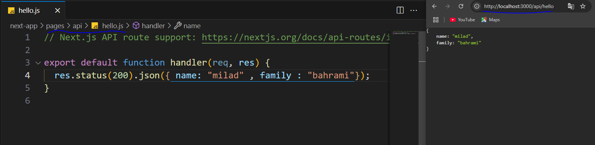
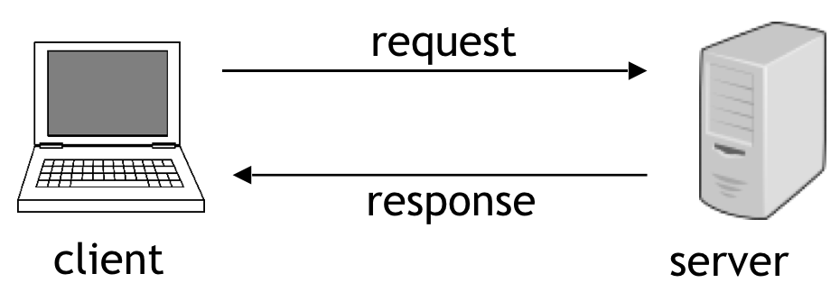

   # [نوشته شده بر اساس دوره next.js سایت next1code میلاد بهرامی](https://next1code.ir/)

   فصل اول :clipboard:

  - قسمت اول [مفهوم-client-و-server](مفهوم-client-و-server)
  - قسمت دوم [وب-سرور-(web-server)-چیه؟](وب-سرور-(web-server)-چیه؟)
  - قسمت سوم [پایگاه-داده-(database)-چیه؟](پایگاه-داده-(database)-چیه؟)
  - قسمت چهارم [مفهوم-پروتکل-(protocol)](مفهوم-پروتکل-(protocol))
  - قسمت پنجم [آشنایی-با-پروتکل-ip-و-dns](آشنایی-با-پروتکل-ip-و-dns)
  - قسمت ششم [وب-چطور-کار-میکنه؟(how-the-web-works)](وب-چطور-کار-میکنه؟(how-the-web-works))
  - قسمت هفتم [مفهوم-پورت-(port)](مفهوم-پورت-(port))
  - قسمت هشتم [url-anatomy](url-anatomy)
  - قسمت نهم [تفاوت-فرانت-اند-و-بک-اند](تفاوت-فرانت-اند-و-بک-اند)


   فصل دوم :clipboard:
  - قسمت اول [عملیات-CRUD](عملیات-CRUD)
  - قسمت دوم [نصب-mongodb](نصب-mongodb)
  - قسمت سوم [mongodb-compass-دقیقا-چیه؟](mongodb-compass-دقیقا-چیه؟)
  - قسمت چهارم [ایجاد-دیتابیس-جدید](ایجاد-دیتابیس-جدید)
  - قسمت پنجم [آشنایی-با-mongosh](آشنایی-با-mongosh)
  - قسمت ششم [ایجاد-collection](ایجاد-collection)
  - قسمت هفتم [متد-insertOne](متد-insertOne)
  - قسمت هشتم [متد-insertMany](متد_inserMany)
  - قسمت نهم [لطفا-داکیومنت-بخون](لطفا-داکیومنت-بخون)
  - قسمت دهم [متد-find-و-findOne](متد-find-و-findOne)
  - قسمت یازدهم [متد-updateOne](متد-updateOne)
  - قسمت دوازدهم [متد-updateMany](متد-updateMany)
  - قسمت سیزدهم [deleteOne-و-deleteMany](deleteOne-و-deleteMany)
  - قسمت چهاردهم [comparison-operators](comparison-operators)
  - قسمت پانزدهم [اپراتور-in$-و-nin$](اپراتور-in$-و-nin$)
  - قسمت شانزدهم [اپراتور-and$](اپراتور-and$)
  - قسمت هفدهم [اپراتور-$or](اپراتور-#or)
  - قسمت هجدهم [اپراتور-all$-و-size$](اپراتور-all$-و-size$)
  - قسمت نوزدهم [متد_limit-و-skip](متد_limit-و-skip)
  - قسمت بیستم [صفحه-بندی-با-limit-و-skip](صفحه-بندی-با-limit-و-skip)
  - قسمت بیستو یکم [متد-sort](متد-sort)

   فصل سوم :clipboard:
  - قسمت اول [api-چیه؟](api-چیه؟)
  - قسمت دوم [json-چیست؟](json-چیست؟)
  - قسمت سوم [بررسی-routing-در-فولدر-api](بررسی-routing-در-فولدر-api)
  - قسمت چهارم [آشنایی-با-handler-function](آشنایی-با-handler-function)
  - قسمت پنجم [آشنایی-با-http-request-methods](آشنایی-با-http-request-methods)
  - قسمت ششم [ارسال-درخواست-با-متد-GET](ارسال-درخواست-با-متد-GET)
  - قسمت هفتم [ارسال-درخواست-با-متد-GET](ارسال-درخواست-با-متد-GET)
  - قسمت هشتم [dynamic-api-route](dynamic-api-route)
  - قسمت نهم [status-code-چیست؟](status-code-چیست؟)
  - قسمت دهم [تعین-status-code](تعین-status-code)
  - قسمت یازدهم [آشنایی-با-request-body](آشنایی-با-request-body)
  - قسمت دوازدهم [آشنایی-با-request-body](آشنایی-با-request-body)
  - قسمت سیزدهم [mime-type-|Context-Type](mime-type-|Context-Type)

    
 فصل چهارم :clipboard:
 - قسمت اول [معرفی-فصل](معرفی-فصل)
 - قسمت دوم [ایجاد-folder-structure-اولیه-و-ساخت-دیتابیس](ایجاد-folder-structure-اولیه-و-ساخت-دیتابیس)
 - قسمت سوم [اصال-به-دیتابیس](اتصال-به-دیتابیس)
 - قسمت چهارم [ساخت-Model](ساخت-Model)
 - قسمت پنجم [get-all-contacts-api](get-all-contacts-api)
 - قسمت ششم [بهینه-تر-کردن-کد-اتصال-به-دیتابیس](بهینه-تر-کردن-کد-اتصال-به-دیتابیس)
 - قسمت هفتم [get-single-contact-api](get-single-contact-api)
 - قسمت هشتم [اعتبارسنجی-object-ID](اعتبارسنجی-object-ID)
 - قسمت نهم [بهینه-کردن-کد-اتصال-به-دیتابیس](بهینه-کردن-کد-اتصال-به-دیتابیس)
 - قسمت دهم [نصب-postman-و-کاربرد-postman-چیه؟](نصب-postman-و-کاربرد-postman-چیه؟)
 - قسمت یازدهم [توسعه-قابلیت-اضافه-کردن-مخاطب-جدید](توسعه-قابلیت-اضافه-کردن-مخاطب-جدید)
 - قسمت دوازدهم [توسعه-قابلیت-حذف-کردن-مخاطب](توسعه-قابلیت-حذف-کردن-مخاطب)


---

فصل 7 - مفاهیم پایه وب (web core concepts)

> # مفهوم client  و server

میخوایم در مورد مفهوم کلی client , server  و هر کدوم چی هستند توضیح بدیم 
یه مثال تو دنیای وافعی بزنیم client  که بهش مشتری هم میگیم میشه سرویس گیرنده  یا ارسال کننده درخواست و اون رو یه فرد تصور کنیم و server  که میشه سرویس دهنده یا پاسخ به درخواست  که یه رستوران هست مثلا  خب این رستوران که سرور ما هست یه سری مشتری داره که بهش میگیم کلاینت این مشتریا میرن میشینن تو رستوران و درخواست میدن یه غذایی رو سرور که میشه رستوران به درخواست اونا پاسخ میده  و سرویس میده  به درخواست اون مشتریا  پس سرور یا همون رستوران به درخواست مشتریا رسیدگی میکنه و میبینه چه غذایی میخوان و بهشون سرویس میده به درخواستشون پاسخ رو ارسال میکنه  که اینجا پاسخ  میشه اون غذا 

`پس client درخواست ارسال میکنه  server یه درخواست ارسال شده از client پاسخ میده `
<div align="center">
  
</div>

<br/>
هلا توی دنیای وب client  میشه همون مرور گرهایی که ما بهاش وارد سایت های مختلف میشیم  و server میشه یه کامپیوتر قدرت مند همیشه روشن متصل به اینترنت هلا فرض کنین ما  تو مرور گرمون که میشه کلاینت سرچ میکنیم میخوایم وارد سایت گوگل بشیم وقتی ما ادرس رو میزنیم در واقع ما داریم یه درخواست میزنیم به سرور گوگل  اون کامپیوتر قدرت مند همیشه روشتن متصل به اینترنت  که گوگل روش میزبانی میشه  که بهش میگیم سرور هلا سرور میاد درخواستی که از کلاینت ارسال شده رو برسی میکنه و بهش جواب میده و اون فایل ها همه چیزی که نیاز هست تا صفحه گوگل رو ما ببینیم ارسال میکنه اون فایل هارو به سمت مرورگر ما مه کلاینت بود 
مثل اون مثال رستوران که رستوران همون سرور بود و مشتری میشد کلاینت که مشتری میاد تو رستوران و یه غذایی رو سفارش میده و رستوران متتاسب با اون درخواست اون غذایی که مشتری خواسته رو بهش میده .

---
> # وب سرور (web server) چیه؟

کفتیم که سرور میشد یه کامپیوتر همیشه روشتن قدرتمند متصل به اینترنت مثل کامپیوتر های ما رم داره spu داره و... و کلاینت میشد اون مرور گر ما که توش ادرس میزدیم و درخواست میزد به سرور و سرور پاسخ مناسب با اون درخواست رو بهش میداد اون فایلا و... هرچی که لازم هست تا اون وب سایت برای ما بالا بیاد و نمایش داده بشه پس server یک سخت افزاره یه قطعه ی  سخت افزاریه  اما web server  یک نرم افزاره  مثل فتوشاپ یا vs code اینا هم یک نرم افزار هستن که ما میاییم اینا رو رو لپ تاپ یا کامپیوترمون نصب میکنیم خب سرور هم یه کامپیوتره دیگه پس روی سرور هم نرم افزارهایی نصب میشه  ولی ما نمیاییم روی سرور فتوشاپ نصب کنیم میایم نرم افزاری روی سرور نصب میکنیم که بتونه به درخواست های client پاسخ بده یعنی درخواست هایی که از client میاد به سمت سرور رو پردازش کنه و پاسخ درست و متناسب رو به اون درخواست بده 

`پس فهمیدیم که web server یه نرم افزاره که روی سرور نصب میشه `
هلا چند تا نرم افزار وب سرور معروف داریم : Apache , Nginx , IIs , Litespeed
یه بار دیگه تاکیید میکنیم که وظیفه وب سرور که روی سرور نصب میشه پردازش و پاسخ دادن به درخواست های کلاینت است . سرور فقط یه کامپیوتر قدرتمند .... است که سخت افزاره و روش وب سرور هایی که نام بردیم نصب میشن.
گفتیم که client ارسال کننده درخواست است به اون درخواستی که کلاینت میفرسته سمت سرور request  میگیم  و به پاسخی که سرور میفرسته به سمت کلاینت بهش میگیم response 


<div align="center">
  
</div>

---

> # پایگاه داده (database) چیه؟

Database
میخوایم درمورد مفهوم Database یا پایگاه داده یاد بگیریم معدل فارسی Database میشه پایگاه داده یا بانک اطلاعاتی  یه نکته سعی کنیم که بیشتر رو خیلی تمرکز نکنیم رو معادل های فارسی ترجیع بدیم که به همون انگلیسیش عادت کنیم و همون انگلیسیشو یاد بگیریم این رو سعنی میکنم یه روتین شخصی خودم قرار بدم 

هلا دیتابیس چیه ؟ دیتابیس یه محلی هست برای ذخیره کردن و نگهداری از اطلاعات محل که اون دیتا اون اطلاعات نگهداری و ذخیره میشن 

🟢محلی برای ذخیره  کردن و نگهداری از اطلاعات

🟢مجموعه ای از اطلاعات که بصورت منظم دسته بندی شده اند

همونطور که مثلا کتابخانه محلی برای ذخیره کردن و نگهداری کتاب هاست و یا گلخانه محلی برای ذخیره و نگهداری گل های است 
دیتا بیس بصورت منظم مرتب و دسته بندی میشن صحبت از نظم و دسته بندی هست یعنی اطلاعات وب سایت ما توی دسته هایی که بهم مرتبت هستن و جدا از هم  تو دسته های مختلف نگهداری میشن 


فرض کنین ما یه وب سایت فروشگاهی میخوایم بزنیم وب سایت ما یه سری کاربر user داره کاربرای ما یه سری اطلاعاتی دارن مثل اینکه ما موقع ثبت نام ازشون نام و... میگیریم که اینا میتونن بیان تو یه دسته یا این کاربرا میتونن بیان و کامنت بزارن زیر محصولات و ما میاییم کل کانتا رو تو یه دسته بندی قرار میدیم  توی سایتمون ما قطعا یه سری محصولاتی داریم سایت فروشکاهی داریم دیگه خب محصولاتی هم داریم که اون اطلاعات مربوط به محصولات رو هم میزاریم تو یه دست بندی که قیمتش چنده ایا موجودی داره یا نه و...  و توسایتمون ممکنه مقالاتی داشته باشیم فرضن درمورد این محصولات مقاله ای هم بنویسم  مثلا موبایل هستن هالا ممکنه یه سری مقالات درمورد تکنولوژی های روز موبایل و... بنویسیم  و منتشر کنیم 


<div align="center">
  
</div>

`پس فهمیدیم که دیتا بیس چیزی نیست جز یک محلی که تمامی اطلاعات سایت ما داخل اون ذخیره و نگهداری میشن  و بصورت منظم و دسته بندی شده`

هلا یه سوال ممکنه پیش بیاد چرا ما بیاد اطلاعات رو بصورت دسته بندی و منظم انجام بدیم چه الزامی به اینکار هست؟؟
یه مثال بزنیم فرض کنین ما یه کتاب خانه داریم که تو این کتاب خانه هیج نظمی نیست و کل کتاب ها همه شون بهم ریخته هستن این چند هزار کتاب هلا یه نفر میخواد بیاد یه کتاب از شما درخواست کنه پیدا کردن اون کتاب چقدر سخته وقتی مظم و دسته بندی وجود نداره معلوم نیست کتابای تاریخی و فلسفی کجان و... توی سایت هم اینطوریه اگه ما دسته بندی نکنیم اطلاعات سایت رو کارمون خیلی بد میشه پس دقیقن کاری که دیتا بیس میکنه مثل دسته بندی قفسه کتاب خانه هست تو کتابخانه مییایم دسته بندی میکنیم که مثلا این قفسه برای کتاب های تاریخیه این برای فلسفیه این برای ... هست و اینطوری خیلی راحتر میتونیم مدیریت کنیم کتاب هاییی که میخوایم 
توی سایت هم اطلاعات کاربرای سایت همه میان دسته بندی میشن


جدول اطلاعات کاربران
| آدی      |نام |  جنسیت |تاریخ تولد |    یوزرنیم |   پسورد |
| ----------- | ----------- | -----------| ----------- | ----------- | ----------- |
| 1   |  میلاد       |  مذکر          |   75/11/2          |     miladb20        |    miladavbs         |
| 2   | الهه           |   مونث          |      ...       |       ...       |      ...      |
| 3   | مهران          |   مذکر          |     ...        |      ...       |     ...        |


اطلاعات کامت ها هم به همین صورت جدا بصورت دسته یندی و منظم

جدول اطلاعات کامنت ها

| آیدی      | یوزر آدی | کامنت      | تاریخ ثبت |
| ----------- | ----------- | ----------- | ----------- |
| 1      | 1       |      متن...       |      1403/02/12       |
| 2   | 1        |    متن ...         |     ...        |
| 3   | 5        |    متن ...         |     ...        |


مشخص هست دقیق که کاربری با این ایدی تو این تاریخ چه کامنتی رو ثبت کرده 
هلا دوباره برای مقالات و ... هم جدول هایی داریم مثل این 
---

> # مفهوم پروتکل (protocol)


میخوایم با مفهوم protocol | پروتکل  اشنا شیم خب با یه مثال خیلی ساده شروع کنیم اگه خاطرتون باشه تو دوران کرونا خیلی کلمه پروتکل های بهداشتی رو میشنیدیم هلا این پروتکل های بهداشتی چی بودن؟ 

پروتکل های بهداشتی :
🟢استفاده از ماسک
🟢رعایت فاصله مناسب
🟢دست ندادن
🟢و...

`مجموعه ای از قوانین و مقررات برای برقراری برای ارتباط بین انسان ها`

پس پروتوکل چیزی نیست جر یه سری قوانین و چهارچوب ها هالا توی دنیای وب 
`مجموعه ای از قوانین برای برقراری بین دو کامپیوتر`

هلا این دوتا کامپیوتر که گفتیم لزومن دقیقن دوتا کامپیوتر نیستن ممکنه یه لپ تاپ با یه سرور مثلا یه تبلت با یه سرور همونطور که گفتیم ما که نقش کلاینت رو داریم تو مرورگر ادرس یه وب سایتی رو میزنیم از کلاینت به سرور اون سایت یه reqest میره و سرور متناسب با اون request  براش یه response یا پاسخ رو به client میفرسته که این رویداد تحت قوانین و مقراراتی تحت یه چهارچوبی ارسال و دریافت میشه که بهش میگیم protocol که تو وب http یا https است انواع مختلف پروتکل ها رو داریم که با چند تا معروفشون اشنا میشیم


<div align="center">
  
</div>

---


> # آشنایی با پروتکل ip و dns

توی قسمت قبل با مفهوم protocol آشنا شدیم  گفتیم که پروتکل چیزی نیست جز مجموعه ای از قوانین ومقررات  و چهارچوب ها که دوتا کامپیوتر برای برقراری ارتباط باهم دیگه ازش استفاده میکنند دوتا از پروتکل هایی که داشتیم ip , dns بود که تو این قسمت برسیش میکنیم چون بهم دیگه ربط هم دارن و باهم مرتبط هستند 

(ip) internet prorocol 
هر دستگاه متصل به اینترنت یه ip مخصوص داره میتونیم آی پی رو به شماره ملی تشبیه کنیم 
یعنی فقط اون ip مخصوص اون دستگاه اینترنتی هست دقیقن مثل شماره ملی هر شخص شما نمیتونین دونفر رو پیدا کنین که شماره ملی مثل هم داشته باشن دقیق  

🟢google.com    142.251.46.206
🟢w3schools.com    13.248.240.135
🟢aparat.com    185.147.178.11

هر دامنه یه ip مختص به خودشو داره در واقع هر سایت رو یه سرور هست دیگه و اون سرور هم چیزی نیست جز یه کامپیوتر قدرت مند همیشه روشن همیشه متصل به اینترنت هست دیگه  اینجام گفتیم که هر دستگاه متصل به اینترنت یه ای پی داره پس اون سرور هم که متصل به اینترنت هست یه ای پی داره 
هلا مثلا سرور google.com   ای پی اون اینه 142.251.46.206 یعنی اگه ما بجای google.com  بیاییم شماره ip  اون سایت گوکل رو داخل مرورگر مون وارد کنیم وارد خود وب سایت گوگل میشه 

`پس متوجه شدیم که هر وب ساتی یه ip منحصر به فرد داره  و این  ip  از چهار بخش تشکیل شده  که از 0 تا 255 میتونه باشه  و توسط نقطه از هم دیگه جدا میشن `

البته دو نوع ای پی داریم یک ای پی ورژن 4 که همینه که توضیح دادیم و یکی ورژن 6 که نیاز نیست درموردش اینجا توضیح بدیم اگه خواستین میتونین درموردش مطلالعه کینن ولی کلیت مفهوم ip اینه 

خب هلا بریم سراغ Dns

Domain Name System <- DNS
پروتکلی که وضیفه تبدیل نام دامنه به ip و بلعکس رو برعهده داره 
🟢google.com  ->    142.251.46.206
🟢aparat.com   ->   185.147.178.11

dns  یه دونه دیگه از پروتکل های مهم  وب است  که بخواییم به فارسی ترجمش کنیم میشه سیستم نام دامنه ولی دنبال معنی فارسیش نریم چون ممکنه یکم بهاش برنخوره با کارش و معنی اصلیشو ازدست میده 
وضیفش تبدیل نام دامنه یا domain به ip و برعکس تبدیل ip به domain رو بعهده داره 

ما به آدرس سایت میگیم Domain یا دامنه 
چون زدن اون ip رو هر بار که بخواییم بزنیم سخته  با استفاده از پروتکل DNS  وقتی ما نام دامنه رو میزنیم اون خودش تبدیل به ip  میکنه و تو سمت سرور هم برعکس انجام میده برای سرور 
مثل دفترجه تلفن هست شما اگه بخوایید شماره هر کسی مثلا 1000 تا مخاطب دارین بجای اینکه شماره هر شخص رو دونه دونه حفظ کنین یا بنویسن رو برگه اسمش رو ذخیره میکنین رو هر بار که رو اسمش بزنین شماره رو میگیره براتون تلفنتون و اینکار خیلی راحت تره به این DNS دفترجه تلفن اسنترنت هم میگن به این اسم  هم معروفه

| Domain      | Ip Address |
| ----------- | ----------- |
| google.com      | 142.251.46.206       |
| w3schools.com   | 13.248.240.135       |
| aparat.com   | 185.147.178.11          |

بخاطر سپردن و وارد کردن نام دامنه سایت خیلی راحت تره تا ای پی ادرسش رو حفظ کنیم.

---

> # وب چطور کار میکنه؟(how the web works)

میخوایم برسی کنیم که دقیقن از لحضه ای که ما ادرس یک وب سایتی رو وارد میکنیم داخل مرورگر مون چه اتفاقاتی میفته و یه جورایی هم مرور کنیم چیزایی که تا الان یاد گرفتیم .

فرض کنین ما داخل مرورگر ادرس google.com رو وارد میکنیم اینجا مرور گر میشه client پس باید یه درسخاست بفرستیم به سرور google.com اما قبلش باید Ip گوگل رو پیدا کنیم اگه خاطرتون باشه گفتیم DNS کارش چیه ؟ تبدیل Domain سابت به Ip و برعکث 

<div align="center">
  
</div>

DNS Server Server Ip گوگل رو به ما میده  هلا که Ip گوگل رو داریم  هلا یه درخواست از سمت مرورگر ارسال میشه به سمت سرور اون سایت هلا اینجا ممکنه که نیاز باشه
یه سری اطلاعات هم از سرور گرفته بشه اگه نیاز به اینکار باشه یه ارتباطی هم بین سرور و دیتا بیس صورت میگیره و چیزهایی که لازم هست رو سرور از دیتابیس میگیره  و در نهایت سرور response یا پاسخی که باید آماده کنه رو اماده میکنه و میفرسته به سمت client و سایت روی مرور گر ما نمایش داده میشه هلا اون پاسخ یه response که میگیم همون فایل های html , css , js  ممکنه عکس باشه یا... بستگی داره چه سایتی درخواست زدیم و کدوم صفحه هست و اون صفحه چه اطلاعاتی داره این میشه ساروکار کلی وب البته که جزیات بیشتری داره که ما واردش نشدیم و بخش های اصلیشو توضیح دادیم .

---

> # مفهوم پورت (port)

کلمه port به معنی  درگاه یا در هست. روی سرور نرم افزارهای مختلفی نصبه سرور چی بود؟ سرور یه کامپیوتر قدرت مند همیشه روشن متصل به انترنت هست خب این یه کامپیوتره دیگه مثل بقیه کامپیوترهای خودمون نرم افزار های مختلفی روش نصبه 
<div align="center">
  
</div>

نرم افزارهایی که مدیریت میکنن درخواست هایی که به سمت سرور ارسال میشه مثل web server ها که انواع شو داریم  دیگه چه چیزهای نصب هست روی سرور مثل نرم افزارهای Database management نرم افزار هایی که وضیفه دارن دیتابیس رو مدیریت کنند و دیگه مثل زبان برنامه نویسی مثلا وقتی ما میخوایم روی یه سرور کد js اجرا کنیم باید روی اون سرور node نصب باشه دقیقن مثل کامپیوتر خودمون که اومدیم نودجی اس رو نصب کردیم و هلا نرم افزار های دیگه .

هلا وقتی یه درخواستی میاد به سمت سرور سرور از جا باید بفهمه که اون درخواست رو باید کدوم نرم افزار مدیریت کنه؟ درخواستو باید بده به webserver یا databaseManagement یا... چطور اینو متوجه میشه؟ از روی port یا درگاه یه مثال هم میرنیم برای فهم بیشتر
فرض کنین شما به یه بانک مراجعه میکنین توی اون بانک باجه های مختلفی وجود داره که هر کدومش مختص به یه کاری هستن

<div align="center">
  
</div>
مثلا اون باجه که بالاش نوشته وام مخصوص اینه که اگه شما میخواید وام بگیرین باید به اون مراجعه کنین و... هلا ما میتونیم پورت رو به همینا تشبیه کنیم هلا ` پورت یه عدد هست` توی باجه های بانکی بالاش اسم باجه هست مثلا وام یا افتتاح حساب و... اما مال پورت یه عدد هست یعنی به هر پورت یه عدد نسبت داده میشه `شماره پورت ها میتونه بین 0 تا 6535 پس تا الان فهمیدیم که port یه درگاه هست یه در هست که اطلاعات از این درها وارد و خارج میشن` 

میخوایم مفهوم پورت هم وارد شبکه وب کنیم که چطوریه چیکارا میکنه برای درک بیشتر وقتی که ما ادرس یک وبسایتی رو وارد میکنیم توی مرورگر چه اتفاقی میفته و مفهوم پورت رو هم واردش کنیم 

<div align="center">
  
</div>

port 443 , 80 مخصوص به webServer هستن
گفتیم که پورت یه عدد هست مثل باجه های بانکی هلا دوتا پورت داریم پورت های بیشفرض 80 و 443 این دوتا عدد این دوتا پورت مخصوص درگاه webserver هستن یعنی اگه درخواستی بیاد  به این پورت 80 یا 443  رو اینا باشه وب سروری که روی سرور ما نصب هست وضیفه داره که به اون درخواست پاسخ بده 

ما وقتی توی مرورگر google.com رو وارد میکنیم درواقع اینطوریه google.com:443 بعد ادرس دامنه یه دونقطه قرار میگیره و بعد هم شماره پورت اما مرورگر خودش بصورت پیشفرض اینو تشخیص میده و نیاز نیست ما بیاییم این :443  رو بنویسیم اما چیزی که درواقع اتفاق میفته اینه که بهمراه https پورتی که اخر ادرس هست و میزاره خود مرورگر 443 هست .

خب یه باردیگه مرور کنیم ما ادرس google.com رو وارد میکنیم یه درخواست میره سمت DNS سرور و ای پی گوگل رو میگیره و یه reqest  از cleint  میره سمت سرور وب سایت گوگل هلا از روی این پورت 443  میفهمه که باید این درخواست رو webServer مدیریت کنه `پس از روی شماره پورت میفهمیم که کدوم نرم افزار باید این درخواست رو مدیریت کنه`  دقیفن مثلا باجه های بانک طرف از روی اسم باجه میفهمه که باید برای درخواست خودش به کردوم باجه مراجعه کنه. درخواست هایی هم که به سرور ارسال میشن سرور از روی شماره پورتشون میفهمه که باید کدوم نرم افزاری که روی سرور نصب هست توسط کدوم باید مدیریت بشن

اگه ما خودمون هم تو مرورگر سرچ کنیم https://www.google.com:443 باز هم سایت گوگل باز میشه چه بنویسم چه ننویسیم ولی درکل خود مرورگر خودش تشخیص میده و مینویسه اخر ادرس

مثلا پورت 3306 مربوط به نرم افزار mySql دیتابیس هست  یا پورت 20 و 21 مربوط به ftp هست ftpچیه یه پروتوکل هست برای انتفال فایل بین کلاینت و سرور  
اگه protocol ادرسمون http باشه پورت اون میشه 80 و اگه https باشه میشه 443
---

> # url anatomy
url چیه؟ ما به یه آدرس اینترنتی میگیم url
همون چیزی که ما تو اینترنت مینویسیم و دنبالش هستیم بهش میگیم url کلمه anatomy هم بهش میگیم کالبدشکافی تشریح و تجزیه هست میخوایم بصورت کلی ببینیم یه ادرس اینترنتی از چه بخش هایی تشکیل شده البته اینو بگیم درحد اطلاعات فعلیمون داریم یه ادرس اینترنتی بخش هاشو برسی میکنیم بصور کلی هست نه با تمام جزییات 


<div align="center">
  
</div>

برای اطلاعات بیشتر و جزییات بیشتر میتونیم تو مرورگر اینا رو سرچ کنیم part of url یا anatomy url که عکسها و مقالاتشونو میتونیم بیشتر بخونیم یه نکته ممکنه تو سایت های مختلف اسم هایی دیگه ای هم رو این بخش هایی که داخل عکس بود بزارن  مثلا به اون protol بگن scheme البته اونا خیلی با جزییات بیشتر توضیح دادن بخش های مختلف یه url رو .
---

> # تفاوت فرانت اند و بک اند

میخوایم تفاوت front-ent , back-end رو باهم برسی کنیم 
توی وب و وب اپلیکیشن ما از فرانت اند و بک اند تشکلیل میشه اون ظاهر کار که ما میبینیمش میشه front-end اون چیزهایی که ما نمیبینیم و پشت صحنه هست میشه back-end 
با یه مثال شروع کنیم مثلا یه برنامه تلیویزیونی رو در نظر بگیریم که کلی عوامل پشت صحنه هستن مثلا فیلم بردار داریم صدا بردار داریم نور پرداز داریم و... اون عواملی که پشت صحنه هستن و ما نمیبینیم اون میشه back-end و اون چیزی که ما میبینیم  مثل بازیگرها میشه front-end 

 <div align="center">
  
</div>
فرض کنین که ما داخل سایتمون یه فرم ثبت نام داریم که چهار تا input داریم و از کاربر میخوایم که نام و نام خانوادگی و ایمیل و پسوردش رو وارد کنه اون فرم ثبت نام که کاربران میبیننش میشه front-end که  با html css js ایجاد میشه  اما وقتی کاربر اطلاعاتشو وارد کرد و روی دکمه ثبت نام بزنه از اینجا به بعدشو بخش back-end میشه پشت صحنه که یوزر یا کاربر نمیبینه .

هر وب سایتی هر وب اپلیکیشنی یه محلی داره به اسم `دیتابیس یا پایگاه داده جایی هست که تمامی اطلاعات سایت ما داخلش ذخیره میشن`  وقتی کاربر روی دکمه ثبت نام کلیک کنه اطلاعاتی که وارد کرده توی فرم ثبت نام میان و داخل database ثبت میشن که این وضیفه برنامه نویس بک اند هست که با دیتابیس ارتباط برقرار کنه اطلاعاتی که کاربر توی فرم وارد کرده رو دریافت کنه وداخل database یا پایگاه داده ذخیره کنه 

هلا فرض کنین ما یه فرم ورود هم داریم login که کاربر ایمیل و پسوردش رو باید بزنه که این میشه ظاهر کار میشه فرانت هالا توی بک اند چه اطفاقی میفته؟ برنامه نویس بک اند میاد این ایمل و پسورد که کاربر وارد کرده رو میگیره و چک میکنه تو database  که ایا کاربری با این ایمل و پسورد وجود داره؟ ثبت نام کرده  هست یا نه  ایمیل رو چک میکنه اگه اصلا همیچنین ایمیلی تو database نباشه یه پیغامی به کاربر نشون داده میشه میگه که اصلا کسی با این ایمیل قبلا ثبت نام نکرده اگه ایمیل رو داشته باشیم ولی پسورد تو دیتابیس با اون ایمیل مطابقت نداشته باشه باید یه پیغامی به کاربر نشون داده بشه که پسورد اشتباه است این شد تفاوت front-end vs back-end
---

فصل دوم : دیتابیس MongooDb


> # عملیات CRUD

قبلا با مفهوم کلی دیتابیس آشنا شدیم گفتیم که Database معنیش به فارسی میشه پایگاه داده و دیتابیس محلی هست که اطلاعات یک وب سایت بصورت منظم و دسته بندی شده ذخیره و نگهداری میشن پس دیتابیس محل ذخیره اطلاعات وب سایت ما هست.

<div align="center">
  
</div>


هلا میخوایم ببینیم عملیات CRUD چی هست؟
این کلمه از کنارهم قرار دادن چهار حرف اول کلمات (Create Read Updare Delet) ساخته شده ایجاد کردن و خواندن و اپدیت و حذف کردن . Create  برای وقتی هست که میخواییم اطلاعات جدیدی رو وارد دیتا بیسمون کنیم در واقع داریم create میکنیم ایجاد میکنیم . همچنین Read یعنی خواندن اطلاعات دریافت اطلاعات از دیتابیس وقتی ما وارد یک وبسایت میشیم و مثلا تو یه صفحه ای همه دوره های اموزشی رو میبینیم خب این اطلاعات از دیتابیس گرفته میشن این اطلاعات read میشن خونده میشن از دیتابیس گرفته میشن و تو اون صفحه نمایش داده میشن مثلا وب سایت دیجیکالا اطلاعات اون محصولات از دیتابیس گرفته میشن و نمایش داده میشن و Update هم یعنی بروزرسانی فرض کنین که ما یک وب سایت اموزشی داریم و میخوایم یکی از محصولات یا دوره هارو ویرایش کنیم مثلا اسم دوره یا نام مدرس یا قیمت یا تعداد دانشجوهای این دوره تغیری میکنه یا... شو تغیری بدیم بهرحال داریم یه تغیری انجام میدیم پس ابدیت کردن اطلاعت هم میشه یکی دیگه از کارایی که میتونیم تو دیتابیس انجام بدیم و Dlete که به معنایی حذف کردن شاید ما به هردلیلی بخوایم مثلا دوره یا محصولی رو حذف کنیم یا یه کاربری رو حذف کنیم یا یه کد تخفیف برای یه مدت بوده و الان میخوایم اون کد تخفیف رو حذف کنیم .

---

> # نصب mongodb

میخوایم دیتابیس MongoDB  رو دانلود کنیم 
وارد مرور گر که شدیم سرچ میکنیم mongoDb  و وارد وب سایت رسمی WW.mongodb.com  میشیم از نوار بالا روی products که کلیک کنیم یه پنجره باز میشه تو قسمت Try Community Edition روی دانلود میزنیم دقت کنین که تو این تاریخ که من مینویسم باید متصل به vpn باشید  سپس وارد یه صفحه میشیم یکم بریم پایین تر میتونیم  برنامه رو دانلود کنیم و سپس نصب کنیم .
دقت کنیم که موقع نصب خودش تیک install mongodb campass رو زده که هم mongodb و هم mongodb campass هم بهاش نصب میشه جریان این mongodb campass اینه که یه GUI هست مخفف (geraphical user interface) هست یعنی رابط گرافیکی campass کلا چیکار میکنه خیلی ساده اگه بگیم mongodbCampass یه نرم افزاره که برای مدیریت پایگاه داده mongodb استفاده میشه یه رابط گرافیکی دراختیارمون میزاره mongodb رو بهاش مدیریت کنیم. 
<div align="center">
  
</div>

---

> # mongodb compass دقیقا چیه؟

توی قسمت قبل mongoDb , mongoDbCampass رو نصب کردیم . گفتیم که mongoDbCampass یه GUI برای mongoDb  هست یه رابط کاربری گرافیکی برای مدیریت و کارکردن با پایگاه داده mongoDb هست میخوایم اینو بهتر جا بندازیم این رابط کاربر گرافیکی .

ما توی ویندوز میتونیم خیلی راحت بصورت گرافیکی کار کنیم مثلا میخوایم یه فولدر جدید درست کنیم کلیک راست میکنیم و  و NewFolder رو میزنیم یا اسمشو تغیر بدیم و درنهایت بخواییم حذفش میکنیم این کارو ما داریم بصورت گرافیکی انجام میدیم  هلا دقیقن این کارا رو میتونیم با cammand ها هم انجام بدیم با cmd  مثلا وارد cmd بشیم و دستور `mkdir milad`  الان یه فولدر درست میشه با اسم میلاد ما به این قسمت cmd میگیم shell - cammand prompt - terminal این اسم هارو به این محیط میگن توی جاهای مختلف اون جاهایی که ما دستور مینویسیم بجای اینکه رابط گرافیکی داشته باشیم .

`
ما درکل برای کار کردن با mongoDb یه محیط Mongo shell داریم منضور اینه که بصور camand خطی کد بنویسم مثل cmd ویندز و یه محیط MongoDb GUI
`
هلا برای کار کردن با databas mongoDb هم ما هم میتونیم camand وارد کنیم هم میتونیم از محیظ گرافیکی استفاده کنیم کار با محیط گرافیکی قطعا خیلی راحتر و ساده تره و این mongodbcampass یکی از ابزارهای گرافیکی برای کاردن با mongodb هست آیا این mongodbcampass تنها ابزار گرافیکی برای کارکردن با mongodb هست ؟ خیر ابرازهای دیگه ای هم هستن کافه سرچ کنیم  gui for mongodb که میشه رابطهای گرافیکی برای mongodb  که ما 7 تاشونو مثال میزنیم DronaHQ و MongoDB Compass و Robo 3T (formerly Robomongo) و Studio 3T (formerly MongoChef) و NoSQLBooster و HumongouS.io و NoSQL Manager 
که ما فعلا با mongodbcampass کارمیکنیم و بعدن سراغ یکی از اینا میریم.
---

> # ایجاد دیتابیس جدید
توی نرم افزار mongodbcampass میخوایم یه دیتابیس ایجاد کنیم و توی دیتابیسمون collection های مختلف ایجاد کنیم وقتی ما مجموعه اطلاعاتی که به هم مربوط مرتبط هستن رو یه جا ذخیره کنیم بهش میگن collection مثلا ما برای یوزر های وب سایتمون میخوایم یه collection یا مجموعه درست کنی دیتای تمامی یوزرهامونو اونجا قرار بدیم

`
نکته برای اسم گزاشتن برای collection  برای اخر اسمش یه s جمع بزاریم بهتره مثلا اگه بخوایم برای دسته بندی یوزر هامون درست کنیم اینطوری بنویسیم users 
`

<div align="center">
  
</div>
<div align="center">
  
</div>
<div align="center">
  
</div>
<div align="center">
  
</div>
<div align="center">
  
</div><div align="center">
  
</div><div align="center">
  
</div><div align="center">
  
</div>
---
> # آشنایی با mongosh
توی این قسمت میخوایم با mongosh یا mongoshell  توی نرم افزار mongoCampass آشنا بشیم . 
اگه دقت کنیم توی این نسخه که من نصب کردم نسخه... بلا سمت راست هست ممکنه توی نسخه ی ای که شما استفاده میکنین جای دیگه باشه یا تغیری کنه تو ابدیتا دنبال Open MongoDB shell  یا MONGOSH بگردین.


روش که کلیک کنیم میتونیم کارایی که بصورت گرافیکی انجام میدادیم یعنی دیتابیس ساختیم و داخلش چند تا collection درست کردیم میتونیم دقیقن همینکارا رو با comand دستور انجام بدیم توی محیط mongosh یا mongosheell 

یه نکته منابع آموزشی که قرار بهاشون بریم جلو تو گوگل اگه سرچ کنیم mongodb tutorial سایت های زیادی میان که ما از چند تاشون استفاده میکنیم 

1_https://www.w3schools.com/mongodb/
2_https://www.mongodb.com/docs/manual/tutorial/getting-started/
3_https://www.tutorialspoint.com/mongodb/index.htm
4_https://www.geeksforgeeks.org/mongodb-tutorial/

این فصل از جزوه رو از ترکیب این 4 سایت میریم جلو 
توب وب سایت w3schols و tutorialspoint هم که بریم توی navbar کناری سمت چپ میتونیم دنبال متن mongoDB - create DB  بگردیم که نوشته

برای اینکه بخوایی لیست کل دیتابیس ها رو بخوای از این دستور داخل mongodb shell  بنویس
```
show dbs
```
برای تغیر دیتابیس یا ساخت دیتابیس جدید دستور کلمه use و اسمی که میخوای برای دیتابیس بزاریم اگه همچنین دیتابیسی از قبل وجود داشته باشه انتخابش میکنه switch میکنیم رو دیتابیس next1code  واردش میشیم و اگر هم همچین دیتابیسی وجود نداشته باشه ایجادش میکنه یه نکته مهم `اگه با این دستور دیتابیس جدیدی درست کنیم و قبلا وجود نداشته باشه تو محیط گرافیکی هم نمایش داده نمیشه چون توش خالیه حتی اگه رفرشش کنیم هم خالیه هیچ colection چون توش نیست چون هنوز دیتایی توش قرار نداره خالیه قابل نمایش نیست بخاطر همین` 
Remember: In MongoDB, a database is not actually created until it gets content!
یک دیتابیس ساخته نمیشه تازمانی که محتوایی داخلش وجود داشته باشه درسته درستش کردیم ولی چون بدون محتوا هست توی لیست دیتابیس ها قرار نمیگیره.

```
use next1code
```
---

> # ایجاد collection

میخوایم با comand یه collection درست کنیم اگه وب سایت هایhttps://www.w3schools.com/mongodb/mongodb_mongosh_create_collection.php   و https://www.tutorialspoint.com/mongodb/mongodb_create_collection.htm رو باز کنیم بخش mongodb که لینکشو قرار دادم وارد بخش  mongoDB Collection بشیم میکه که یک متد وجود داره به اسم createCollection()  که دوتا وردی میپذیره db.createCollection(name , options)  که name اجباری هست و option  اجباری نیست یعنی میتونیم قرار ندیم این name هم درواقع نام collection هست که میخوایم ایجاد کنیم 

ما دوتا راه  دوتا روش داریم که یک collection بسازیم که روش اول اینه که از متد createCollection() استفاده کنیم روش دوم بیاییم از insert استفاده کنیم که تو قسمت بعدی توضیح میدیم .

اول یه دیتابیس درست کنیم
```
use next1code
```

اگه وارد mongoshell بشیم تو mongocampass با دستور 
```
db.createCallection('users')
```
این db که نوشتیم اول داره اشاره میکنه به اون دیتابیس که ایجاد کردیم منضورش همون next1code هست
که در پاسخ `{  ok:1  }`  یعنی باشه یک کالیکشن ایجاد شد.
---

> # متد insertOne

توی قسمت قبل تونستیم collection درست کنیم و گفتیم که با دو روش میتونیم درست کنیم تو این قسمت برسی میکنیم که چطور داخل اون کالکشن دیتا ذخیره کنیم `به اون دیتای داخل collaction داکیومنت (document) میگیم به هرمدومشون ممکنه هر کالکشن 100 تا 1000 تا داکیومنت یا همین object ها داخلش باشه`  و همچنین اون روش دوم ایجاد کالکشن رو برسی میکنیم .

برای درج کردن یا وارد کردن دیتا داخل collaction مون دستور این db داره اشاره میکنه به اون دیتابیس مون که مثلا دیتابیس next1code است و .users داره اشاره میکنه به اون کالکشن که میخواییم دیتایی رو توش اضافه کنیم و متد .insertPne یعنی یک دیتا درج کن که داخلش بصورت {object} دیتامون رو مینویسیم.
```
db.users.insertOne({ name : 'milad' , family : 'bahrami' , email : 'milad@yaho.com' , password : '123456'})
```
اینو که بزنیم یه همچنین object توی callection users ایجاد میشه  که گفتیم به این object که نوشتیم توی کالکشن یه اصطلاحی داره بهش میگیم داکیومنت document

`یه نکته ریز اگه توی این محیط mongoshell کلمه cls رو بزنیم که مخفف عبارت clear screen  است محیط خالی میشه و کد های قبل پاک میشن`

روش دوم ایجاد collection جدید
گفتیم که یکی استفاده از متد createCollection بود که اینطوری بود db.createCollection(posts)  با یه  روش دیگه هم میتونیم :
```
db.users.insertOne(object)
```
مثل کد قبل که یه یوزر میلاد اضافه کردیم درواقع وقتی ما برای بار اول یه چیزی رو insert کنیم دخل دیتابیس و خب باید به کالکشن اون اشاره کنیم اگه بار اول باشه و قبلا اون کالکشن ایجاد نشده باشه هم این کالکشن رو میسازه هم این اطلاعات رو واردش میکنه که به این دیتایی که درج میشه داخلش میگفتیم داکیومنت
```
db.theachers.insertOne({ name : 'milad' , family : 'bahrami' , email : 'milad@yaho.com' , password : '123456' skill : ['react','nodejs']})
```

---

> # متد insertMany

با متد insertOne میتونستیم  یه object  دیتا وارد کنیم به کالکشنمون با متد insertMany میتونیم یه ارایه متشکل از چندین ابجکت درست کنیم [{...} , {...} , {...}]

```
db.users.insertMany(
  [
   { name : 'nika' , family : 'shakarami' , email : 'nika@google.com' , password : '123456'},
   { name : 'asgjar' , family : 'ahmadi' , email : 'asghar@yaho.com' , password : 'asdfasdfasdf'},
   { name : 'sara' , family : 'abbasi' , email : 'sara@yaho.com' , password : 'se1452'}
  ]
)
```
`یه نکته: ما اگه بخوای داخل پرانتز این متد اینتر بزنیم و بخواییم داخلش اینتر بزنیم و ارایه و ابجکت ها رو بنویسم کد اجرا میشه به محظ اینتر زدن ولی اگه کلید Sheft و سپس Enter رو بزنیم میتونیم فاصله از پایین هم ایجاد کنیم مثل تصویر`
معنی کلمه many میشه (چندین,بسیاری,چندتا)

` پس با insertOne میتونستیم یک داکیومنت درج کنیم اضافه کنیم و با insertMany میتونیم چندین تا اضافه کنیم `

---

> # لظفا داکیومنت بخون

تو این قسمت میخوایم یکم حرف دلی بزنزنیم اینا حرفای میلاد بهرامی است . یکی از چیزایی که شما قراره به عنوان کسی که شغلش برنامه نویسی باشه باید بهش عادت کنه ببین باید یعنی یک اجبار هست باید بهش عادت کنیم داکیومنت خوندن هست همه مدرس ها هم خودشون از روی داکیومنت ها دارن دوره میزارن و یادمیگیرن چه خوب دوره هایی که میان مییان دوره شون داکیومنت هم باز میکنن و منبع میگن و کنارش توضیحات میدن و دست به کد میشن مستقیم نمیان کد بنویسن داخل vscode یا... این کار باید باعث بشه که ماهم داکیومنت بخونیم و بهش عادت کنیم شما هم باید یادبگیرین که با داکیومنت خوندن اطلاعات جدید کسب کنین 90دصد موفق شدن توی برنامه نویسی رو طی کردین هر چقدر شما روی زبانتون وقت بزارین موفقیتتون توی برنامه نویسی حتمی تر میشه پس سعی کنین حتما یه تایمی رو برای زبان هم بزارین اما اگه الان زبانتون قوی نیست اشکالی نداره به مرور زبانتون قوی میشه با داکیومنت خوندن حتما هر مطلبی که توی جلسه های اینده که گفتیم از تو وب سایت های که قسمت های قبل گفتیم رو حتما برسی کنین شروع کنین به داکیونت خونندن بزارین عادت بکنین رفقا تکنولوژی های برنامه نویسی در گزر زمان با سرعت باورنکردنی ابدیت میشن یعنی همین mongodb هی داره ابدیت میشه خود nodejs هی داره ابدیت میشه ورژن های جدید ازش میاد و وقتی ابدیتی به وجود میاد تغیری به وجود میاد توی یه تکنولوژی طبیعتن اولین بار اون اطلاعات به زبان انگلیسی منتشر میشن هالا کلی بعدش با کلی تاخیر یه نفر میاد اون ابدیته رو تبدیل به یه دوره اموزشی میکنه به زبان فارسی میکنه یکی تبدیل به مقاله میکنه خلاصه تو این زمان کلی وقفه به وجود میاد اگه شما زبانتون خوب باشه و بلد باشین داکیومنت بخونین عادت کرده باشید خودت میری از داکیومنت اصلی میخونی  به عنوان یک برادر اگه میخواید توی برنامه نویسی حرفی برای گفتن داشته باشید و روی برنامه نویسی به عنوان یک شغل حساب باز کنین `چاره ای ندارین جز اینکه به داکیومنت خوندن عادت کنین` و چه بهتر که از همینجا شروع بکنین که زبانت خیلی ضعیفه توی یکی دو سال بهش عادت میکنین .

---

> # متد find و findOne

حتما قبلش وارد سایت w3schols  ادرس  https://www.w3schools.com/mongodb/mongodb_mongosh_find.php بشید و از ناوبار سمت چپ وارد بخش mongoDB Find از رو داکیومنت هم بخونیم که عادت کنیم . 

معنی کلمه find میشه پیداکردن . ما یه سری دیتا یا اطلاعات که میگفتیم بهشون داکیومنت توی داکلشن هامون که تو دیتابیس مون بود داشتیم هلا ما میخوایم از بین این داکیومنت ها انتخاب کنیم مثلا میگم اونی که ایدیش برابر فلان هست یا مثلا اونی که اسمش نیکا هست رو انتخاب کن اونی که ایمیلش فلان هست رو انتخاب کن `پس اگه بخوایم از بین این داکیومنت ها بگردیم و هلا طبق یه شرایطی از بین این داکیومنت ها یه تعداد یا یکی شونو انتخواب کنیم از دوتا متد ()find() , findOone استفاده میکنیم `

اگه بخوایم یکی پیدا کنیم از اطلاعات یا اون داکیومنت هایی که داریم از متد findOne() و اگه بخوایم بیش از یکی پیدا کنیم از متد find() استفاده میکنیم  


به عنوان وردی متد find() ما باید بهش یه {object} پاس بدیم که اسمش `query object` هست هلا در ادامه بیشتر بهاش اشنامیشیم و اگه به عنوان وردی این متد find() هیچی ننویسیم هیچی بهش پاس ندیم و خالی رهاش کنیم empty باشه یعنی خالی همه داکیومنت ها رو برمیگردونه همه رو میده اگه بهش چیزی ندیم همه داکیومنت هارو میده 

فرض کنین که ما پنج داکیومنت داریم توی کالکشن users  و بدون هیچ مقدار یا query object  نمیدیم:
```
db.users.find()
```
چون چیزی مشخص نکردیم به عنوان پاسخی که میده همه داکیومنت ها رو پاس میده  تو متد .find()
```
[
  {_id : ObjectId("62c350dc07d768a33fdfe9b0") , name : 'ali' , lastName: 'karimi' , email : 'ali@yahoo.com' , password : '12345678'},
  {_id : ObjectId("62c350dc07d768a33fdfe9b0") , name : 'nika' , lastName: 'shakarami' , email : 'nika@eail.com' , password : '1ddw45678'},
  {_id : ObjectId("62c350dc07d768a33fdfe9b0") , name : 'asghar' , lastName: 'ahmadi' , email : 'asghar@yahoo.com' , password : 'p456dhhuy'},
  {_id : ObjectId("62c350dc07d768a33fdfe9b0") , name : 'mamad' , lastName: 'tarj' , email : 'mamad@yahoo.com' , password : '123ds6fr8'},
  {_id : ObjectId("62c350dc07d768a33fdfe9b0") , name : 'milad' , lastName: 'bahrami' , email : 'milad@yahoo.com' , password : 'wf6718sad'},
]
```

هلا متد findOne() برای اینکه فقط یک داکیومنت رو انتخاب کنیم میتونیم از متد findOne() استفده کنیم اینم دباره مشابه find بعنوان ورودی یه query object میگیره که اگه خالی بزاریم چیزی براش ننویسم چیزی که return  میکنه چیزی که برمیگردونه اولین داکیومنت رو  
```
db.users.findOne()
```

```
{_id : ObjectId("62c350dc07d768a33fdfe9b0") , name : 'ali' , lastName: 'karimi' , email : 'ali@yahoo.com' , password : '12345678'}
```

هلا این دو متد findOne , find میتونن به عنوان وردی که اسمش ورودی هاشون بود query object میتوننن به عنوان رودی یه object بپذیرن که یه سری شرایط دارن  هلا از findOne رو برسی میکنیم 

```
db.users.findOne({ name : 'milad'})
```
میره اولین داکیومنتی که اسمش میلاد هست رو پیدا میکنه 
```
 {_id : ObjectId("62c350dc07d768a33fdfe9b0") , name : 'milad' , lastName: 'bahrami' , email : 'milad@yahoo.com' , password : 'wf6718sad'}
```


`به اون object که به عنوان وردی به این دو متد میدیم بهش میگن query object` هلا این یکم داستان داره که بیشتر بهاش اشنا میشیم ما یه projection هم داریم  ورودی find که میشه یه object که بهش quert object میگفتیم یه مقدار دیگه هم میتونه داشته که اون هم object هست.  یکیش اون چیزی هست که ما دنبالش میگردیم که تو مثال نوشتیم name : 'milad' بود مثلا دنبال اسم هستیم  که یه ابحکت هست برسی کردیم و اون ورودی دیگه که اسمش projection هست که اون هم ابجکت هست میتونیم مشخص کنیم که ما فقط name , lastName رو میخوایم و بقیه اطلاعات رو نمیخواییم برای هر دو متد هست میتونیم استفاده کنیم 

هلا یه مثال بزنیم برای درک بهتر اول فقط با query object بدون وردی دوم بزنیم :

```
db.users.findOne({ name : 'milad'})
```
میره اولین داکیومنتی که اسمش میلاد هست رو پیدا میکنه 
```
 {_id : ObjectId("62c350dc07d768a33fdfe9b0") , name : 'milad' , lastName: 'bahrami' , email : 'milad@yahoo.com' , password : 'wf6718sad'}
```
همونطور که میبینین کل اطلاعاتشو میده id , name , lastName , emeil , password  همه شو میده مثلا من فقط name , lastName شو میخوام بقیشو نمیخوام بده :
```
db.users.findOne( {name : 'milad'} , {name : 1 , lastName : 1}  )
```
`اگه name:0 قرار بدم یعنی name  رو نمیخوام اگه name:1 قرار بدم یعنی name رو میخوام`

```
{_id : ObjectId("62c350dc07d768a33fdfe9b0") , name : 'milad' , lastName: 'bahrami'}
```
هلا میتونیم یه کاری کنیم که اون id رو هم نده  اون رو اینبار برابر 0 میزاریم مینویسیم
```
db.users.findOne({name : 'milad' } , {name : 1 , lastName : 1 , _id : 0})
```
```
{ name : 'milad' , lastName: 'bahrami'}
```

---

> # متد updateOne

ما میتونیم داکیومنت هامون رو مقادیرشو update بروزرسانی کنیم 

```
[
  {_id : ObjectId("62c350dc07d768a33fdfe9b0") , name : 'ali' , lastName: 'karimi' , email : 'ali@yahoo.com' , password : '12345678'},
  {_id : ObjectId("62c350dc07d768a33fdfe9b0") , name : 'nika' , lastName: 'shakarami' , email : 'nika@eail.com' , password : '1ddw45678'},
  {_id : ObjectId("62c350dc07d768a33fdfe9b0") , name : 'asghar' , lastName: 'ahmadi' , email : 'asghar@yahoo.com' , password : 'p456dhhuy'},
  {_id : ObjectId("62c350dc07d768a33fdfe9b0") , name : 'mamad' , lastName: 'tarj' , email : 'mamad@yahoo.com' , password : '123ds6fr8'},
  {_id : ObjectId("62c350dc07d768a33fdfe9b0") , name : 'milad' , lastName: 'bahrami' , email : 'milad@yahoo.com' , password : 'wf6718sad'},
]
```
این داکیومنت ها که داخل کالکشن users هستن میتونیم مقادیری که دارن رو بروزرسانی کنیم مثلا name  یا ...  شون رو یه مثال مثلا شما تو یه سایت ثبت نام کردین و میخوایین password تون رو تغیر بدین خب این پسورد شما تو دیتابیس تو یه جایی ذخیره میشه و هالا درواقع شما دارین پسورد تون رو ابدیت میکنین تغیرش میدید .

میتونیم از دو متد updateOne() و updateMany() استفاده کنیم . اگه بخوایم یکی از این داکیونت هارو بروز رسانی کنیم از updateOne استفاده میکنیم اگه بخواییم بیش از یک داکیومنت رو ابدیت کنیم  بصورت همزمان از updateMany استفاده میکنیم مثلا بگیم همه داکیومنت هامون پسوردشون بشه 12345678 اینطوری داریم بیش از یک داکیومنت رو ابدیت کنیم پس در اینصورت از updateMany استفاده میشه .

 ما الان میخوایم سومی که name : 'asghar' هست رو password : 'p456dhhuy' که هست رو  تغیر بدیم ابدیت کنیم 
 ```
db.users.updateOne(
  {email : 'asghar@yahoo.com'},
  {$set : {password : '7878980011'}}
)
```
که چیزی که بهمون میگه تو mongoshell :
```
{
  acknowledged: true,
  insertedId: null,
  matchedCount: 1,
  modifiedCount: 1,
  upsertedCount: 0
}
```
یعنی  matchedCount: 1 میگه این چیزی که من دنبالش گشتم با چند تا داکیومنت ها match شده با چند تا مطابقط داره فقط یکی بود دیگه که با این ایمیل بود که ما نوشتیم بعد نوشته modifiedCount :1 یعنی تغیر داده شده داره داکیومنت هایی که تغیر داده شده رو نوشته یک 


میتونیم از یک داکیومنت چند فیلد دیگه چند کلید دیگه رو هم باهم تغیر بدیم :


 ```
db.users.updateOne(
  {email : 'asghar@yahoo.com'},
  {$set : {lastName : 'bahrami' , password : '7878980asq'}}
)
```
---

> # متد updateMany

متد opdateOne همونطور که از اسمش مشخصه فقط برای ابدیت کردن یک داکیومنت میتونیم ازش استفاده کنیم  اما اگه بخوایم بیش از یک داکیومنت رو ابدیت کنیم از متد updateMany استفاده میکنیم مثلا همه اونایی که جنسیت شون اقا هست رو پسوردشون یا چیزی شون رو تغیری بدم یا مثلا همه کاربرانی که سنشون از یه عدد موردنظری بزرگتره یا کوچکتره است رو یه جایی شو یه ابدیتی کنم توی این موارد توی این کیس ها ما از updateMany استفاده میکنیم الان ما یه داکیومنت دیگه هم اضافه میکنیم که اونم lastName bahrami باشه 
```
db.users.insertOne{{name: 'mehrdad' , lastName : 'bahrami' , email : 'mehrdad@yahoo.com' , password : 'asdfasdf111'}}
```
هلا کالکشن users اینطوری شده 6تا کالکشن
```
[
  {_id : ObjectId("62c350qc07d768a33fdfe9b0") , name : 'ali' , lastName: 'karimi' , email : 'ali@yahoo.com' , password : '12345678'},
  {_id : ObjectId("62c350dc07d768a33fdfe9b0") , name : 'nika' , lastName: 'shakarami' , email : 'nika@eail.com' , password : '1ddw45678'},
  {_id : ObjectId("62c350dc07d768a33ddfe9b0") , name : 'asghar' , lastName: 'ahmadi' , email : 'asghar@yahoo.com' , password : 'p456dhhuy'},
  {_id : ObjectId("62c350dc07d768a33wdfe9b0") , name : 'mamad' , lastName: 'tarj' , email : 'mamad@yahoo.com' , password : '123ds6fr8'},
  {_id : ObjectId("62c350dc07d768a33fdfe9b0") , name : 'milad' , lastName: 'bahrami' , email : 'milad@yahoo.com' , password : 'wf6718sad'},
  {_id : ObjectId("62c350dc07d768a33fdfe7b0") , name : 'mehrdad' , lastName: 'bahrami' , email : 'mehrdad@yahoo.com' , password : 'asdfasdf111'}
]
```

الان کاری که میخواییم انجام بدیم اینه که اونایی که  'lastName : 'bahrami دارن رو password شون رو تغیر بدیم باهم 

```
db.users.updateMany(
  {lastName : 'bahrami'},
  {$set : {password : '40009'}}
)
```
الان هر دوتا اونایی که 'lastName : 'bahrami'  بودن دوتا شون پسوردشون تغیر کرده.

---

> #  deleteOne و deleteMany

فرض کنین که ما تو کالکشن users مون چند تا کالکشن داریم و میخوایم اونی که password : '78784555' رو حذف کنیم میتونیم با استفاده از دوتا متد deleteOne , dleteMany این کارو انجام بدیم که dleteOne برای حذف کردن یک داکیومنت استفاده میشه و deleteMany برای حذف بیش از یک داکیومنت استفاده میشه .


این رو کالکشن users درنظر بگیرین
```
[
  {_id : ObjectId("62c350qc07d768a33fdfe9b0") , name : 'ali' , lastName: 'karimi' , email : 'ali@yahoo.com' , password : '12345678'},
  {_id : ObjectId("62c350dc07d768a33fdfe9b0") , name : 'nika' , lastName: 'shakarami' , email : 'nika@eail.com' , password : '1ddw45678'},
  {_id : ObjectId("62c350dc07d768a33ddfe9b0") , name : 'asghar' , lastName: 'ahmadi' , email : 'asghar@yahoo.com' , password : 'p456dhhuy'},
  {_id : ObjectId("62c350dc07d768a33wdfe9b0") , name : 'mamad' , lastName: 'tarj' , email : 'mamad@yahoo.com' , password : '123ds6fr8'},
  {_id : ObjectId("62c350dc07d768a33fdfe9b0") , name : 'milad' , lastName: 'bahrami' , email : 'milad@yahoo.com' , password : 'wf6718sad'},
  {_id : ObjectId("62c350dc07d768a33fdfe7b0") , name : 'mehrdad' , lastName: 'bahrami' , email : 'mehrdad@yahoo.com' , password : 'asdfasdf111'}
]
```
هلا میخوایم یکی  رو حذف کنیم :
```
db.users.deleteOne({ _id : 'ObjectId("62c350qc07d768a33fdfe9b0"'})
```
متد dleteOne  میره میگرده از اولین برسه به هرکدوم مثلا فرض کنین ما دوتا یوزر با lastName : 'bahrami' داریم اگه از متد dleteOn استفاده کنیم میره میگرده به اولین که رسید همون رو حذف میکنه و کارش تموم میشه 

```
db.users.deleteMany({ lastName : 'bahrami'})
```
الان چیزی که برمیگردونه داخل mongosell میگه دوتا حذف داشتیم
```
{
  acknowledged : true,
  deletedCount : 2
}
```
> # comparison operators

تو این قسمت از دوتا منبع https://www.w3schools.com/mongodb/mongodb_query_operators.php بخش MongoDB Query Operators 


و سایت https://www.mongodbtutorial.org/ بخش Comparison Query Operators که برای هرکدوم یه مثال زده 
در کل قراره با این سه دسته بندی کامند های mongoshell آشنا بشیم و کاربرد ها شو برسی کنیم


Comparison
The following operators can be used in queries to compare values:

- $eq: Values are equal
- $ne: Values are not equal
- $gt: Value is greater than another value
- $gte: Value is greater than or equal to another value
- $lt: Value is less than another value
- $lte: Value is less than or equal to another value
- $in: Value is matched within an array
----------


Logical
The following operators can logically compare multiple queries.

- $and: Returns documents where both queries match
- $or: Returns documents where either query matches
- $nor: Returns documents where both queries fail to match
- $not: Returns documents where the query does not match
---------


Evaluation
The following operators assist in evaluating documents.

- $regex: Allows the use of regular expressions when evaluating field values
- $text: Performs a text search
- $where: Uses a JavaScript expression to match documents
--------


فرض کنین که ما تو دیتابیسمون یه کالکشن users داریم که 7 تا داکیومنت داخلش هستن:

```
[
  
  {
  _id: {"$oid": "67cd90cefdd5c8185ddd2e9e"},
  name: "milad",
  famile: "bahrami",
  email: "milad@yahoo.com",
  password: "12345678m",
  age : '24',
  skills: ["html","css","js","react","nextJs"]
},
  {
  _id: {"$oid": "67cd90fffdd5c8185ddd2e9f"},
  name: "ali",
  famile: "karimi",
  email: "ali@yahoo.com",
  password: "12345678a",
  age : '24',
  skills: ["html","css","js"]
},
  {
  _id: {"$oid": "67cd9132fdd5c8185ddd2ea0"},
  name: "nika",
  famile: "shahkarami",
  email: "nika@yahoo.com",
  password: "12345678n",
  age : '21',
  skiils: ["html","css","js","react","nextJs","nodeJs"]
},
  {
  _id: {"$oid": "67cd9170fdd5c8185ddd2ea1"},
  name: "asghar",
  famile: "ahmadi",
  email: "asghar@yahoo.com",
  password: "12345678as",
  age : '19',
  skills: [ "html","css"]
},
  {
  _id: {"$oid": "67cd920ffdd5c8185ddd2ea2"},
  name: "mahsa",
  famile: "ahmadi",
  email: "mahsa@yahoo.com",
  password: "12345678ma",
  age : '40',
  skills: ["html","css"]
},
  {
  _id: {"$oid": "67cd923efdd5c8185ddd2ea3"
  },
  name: "yasin",
  famile: "shahkarami",
  email: "yasin@yahoo.com",
  password: "asdfasdfaYas",
  age : '35',
  skills: ["html","css","js","react","nextJs","nodeJs"]
},
  {
  _id: {"$oid": "67cd9268fdd5c8185ddd2ea4"
  },
  name: "shadman",
  famile: "bahrami",
  email: "milad@email.com",
  age : '39',
  password: "1fgf567sh",
  skills: ["html","css","js","react","nextJs"]
}
  
]
```

خب ما بیاییم از متد find استفاده کنیم که یادگرفته بودیم:
```
db.users.find({email : 'milad@yahoo.com'})
```
و تو خروجی که mongoshell میده دقیقن میگرده و همونو پیدا میکنه میده بهمون.
```
{
  _id: ObjectId('67cd90cefdd5c8185ddd2e9e'),
  name: 'milad',
  famile: 'bahrami',
  email: 'milad@yahoo.com',
  password: '12345678m',
  age : '24',
  skills: [
    'html',
    'css',
    'js',
    'react',
    'nextJs'
  ]
}
```


```
db.users.find({email : {$eq : 'milad@yahoo.com'}})
```
این دقیقن معادل همون کد بالا هست که نوشتیم `db.users.find({email : 'milad@yahoo.com'})`یعنی اینجا استفاده از این `eq` واقعا کار بیخودی هست وقتی میتونیم ساده تر بنویسیم  این هم تو خروجی دقیقن مثل بالا ابجکتی که پیدا میکنه رو میده .


یه اپراتور دیگه هم داریم به اسم مخخفف  `$ne: Values are not equal` که به معنای نابرابر است مثلا میتونیم بگیم همه کاربرایی رو برام پیداکن بغیر از اونی که 'email : 'milad@yahoo.com است 
```
db.users.find({email : {$ne : 'milad@yahoo.com'}})

```
این الان به این معنی هست که بهش گفتیم برو تو دیتابیس توی کالکشن users و find کن پیداکن بر اساس email داریم فیلتر رو انجام میدیم و گفتیم اونایی که  ایمیلشون نابرابر هستن با milad@yahoo.com یعنی ایملش هرچیزی باشه بغیر از این اونا رو پیداکن  که ما 7 تا داکیومنت داشتیم اون 6 تای دیگه رو میده تو خروجی که ایملاشون این نیستن 


هلا میخواییم براساس سنشون سرچ انجام بدیم از `gt` استفاده میکنیم یعنی بزرگتر از . بگیم همه اونایی که سنشون بزرگتر 28 هست رو پیداکن 
```
db.users.find({age : {$gt : 28}})
```
این به این معنی هست که میگیم برو تو کالکشن users پیداکن اونایی که سنشون از 28 بزرگتره 
که تو خروجی سه تا شونو میده که سنشون از 28 بزرگتره 
```
[
{
  _id: ObjectId('67cd920ffdd5c8185ddd2ea2'),
  name: 'mahsa',
  famile: 'ahmadi',
  email: 'mahsa@yahoo.com',
  password: '12345678ma',
  skills: [
    'html',
    'css'
  ],
  age: '40'
},
{
  _id: ObjectId('67cd923efdd5c8185ddd2ea3'),
  name: 'yasin',
  famile: 'shahkarami',
  email: 'yasin@yahoo.com',
  password: 'asdfasdfaYas',
  skills: [
    'html',
    'css',
    'js',
    'react',
    'nextJs',
    'nodeJs'
  ],
  age: '35'
},
{
  _id: ObjectId('67cd9268fdd5c8185ddd2ea4'),
  name: 'shadman',
  famile: 'bahrami',
  email: 'milad@email.com',
  password: '1fgf567sh',
  skills: [
    'html',
    'css',
    'js',
    'react',
    'nextJs'
  ],
  age: '39'
}

]

```

هلا میخوایم بگیم اونایی که سنشون کوچکتر از 28 سال هست رو پیدا کن :
```
db.users.find({age : {lt : 28}})
```
که چهار تا ابجکت همون میده که سنشون از 28 کوچکتره
```
[

{
  _id: ObjectId('67cd90cefdd5c8185ddd2e9e'),
  name: 'milad',
  famile: 'bahrami',
  email: 'milad@yahoo.com',
  password: '12345678m',
  skills: [
    'html',
    'css',
    'js',
    'react',
    'nextJs'
  ],
  age: '24'
},
{
  _id: ObjectId('67cd90fffdd5c8185ddd2e9f'),
  name: 'ali',
  famile: 'karimi',
  email: 'ali@yahoo.com',
  password: '12345678a',
  skills: [
    'html',
    'css',
    'js'
  ],
  age: '24'
},
{
  _id: ObjectId('67cd9132fdd5c8185ddd2ea0'),
  name: 'nika',
  famile: 'shahkarami',
  email: 'nika@yahoo.com',
  password: '12345678n',
  skills: [
    'html',
    'css',
    'js',
    'react',
    'nextJs',
    'nodeJs'
  ],
  age: '21'
},
{
  _id: ObjectId('67cd9170fdd5c8185ddd2ea1'),
  name: 'asghar',
  famile: 'ahmadi',
  email: 'asghar@yahoo.com',
  password: '12345678as',
  skills: [
    'html',
    'css'
  ],
  age: '19'
}

]
```

هلا میخواییم بگیم کوچکتر و مساوی 28 سال 

```
db.users.find({age : {lte : 28}})
```
این به این معنیه که کاربرانی که برابر 28سال  هستن و کوچکتر هستن

---

> # اپراتور in$ و nin$

البته توی w3schols فقط اپراتور $in رو گفته اما یه دونه اپراتور $nin رو داریم که اونو نگفته که اون رو نگفته و علت اینکه گفتیم از چند تا منبع استفاده کنیم همینه ممکنه یکی بیشتر و یکی کمتر یا یکی چیزی رو کلا نگفته باشه . اما تو منبع دیگه که وب سایت mongodbtutorial هست اپراتور $nin رو گفته 


https://www.w3schools.com/mongodb/mongodb_query_operators.php

https://www.mongodbtutorial.org/mongodb-crud/mongodb-ne/

این اپراتور $in  برایش شامل شدن و $nin برای شامل نشدن هست که in (incluid) , nin (not incluid) اگه دقت کرده باشین ما تو دیتابیسمون کالکشن users ما هرکدوم از داکیومنت هامون یه اپراتور  به اسم skills داشتن که یه ارایه بودن که یک ارایه هست که هر کدوم از اعضای این ارایه یه رشته هستن که دارن مهارت اون uer هست.


هالا ما میخوایم تو این ارایه skills یه سرچ انجام بدیم بر اساس مثلا همه کاربرایی رو پیداکن که توی ارایه sliks شون react وجود داره 
```
db.users.find({skills : {$in : ['react']}})
```
الان این به این معنا هست  که برو تو collection users و پیداکن find کن اونایی رو که توی پراپرتی skills شون رشته 'react' وجود داره  این $in  به معنای incluid هست که میشه شامل شدن که تو خروجی اینا رو میده

```
[
{
  _id: ObjectId('67cd90cefdd5c8185ddd2e9e'),
  name: 'milad',
  famile: 'bahrami',
  email: 'milad@yahoo.com',
  password: '12345678m',
  skills: [
    'html',
    'css',
    'js',
    'react',
    'nextJs'
  ],
  age: '24'
},
{
  _id: ObjectId('67cd9132fdd5c8185ddd2ea0'),
  name: 'nika',
  famile: 'shahkarami',
  email: 'nika@yahoo.com',
  password: '12345678n',
  skills: [
    'html',
    'css',
    'js',
    'react',
    'nextJs',
    'nodeJs'
  ],
  age: '21'
},
{
  _id: ObjectId('67cd923efdd5c8185ddd2ea3'),
  name: 'yasin',
  famile: 'shahkarami',
  email: 'yasin@yahoo.com',
  password: 'asdfasdfaYas',
  skills: [
    'html',
    'css',
    'js',
    'react',
    'nextJs',
    'nodeJs'
  ],
  age: '35'
},
{
  _id: ObjectId('67cd9268fdd5c8185ddd2ea4'),
  name: 'shadman',
  famile: 'bahrami',
  email: 'milad@email.com',
  password: '1fgf567sh',
  skills: [
    'html',
    'css',
    'js',
    'react',
    'nextJs'
  ],
  age: '39'
}
]
```

هلا میتونیم بگیم اونایی که رشته react تو skills نیستن :
```
db.users.find({skills : {$nin : ['react']}})
```

---
> # اپراتور-and$


Comparison
The following operators can be used in queries to compare values:

- $eq: Values are equal
- $ne: Values are not equal
- $gt: Value is greater than another value
- $gte: Value is greater than or equal to another value
- $lt: Value is less than another value
- $lte: Value is less than or equal to another value
- $in: Value is matched within an array
----------


Logical
The following operators can logically compare multiple queries.

- $and: Returns documents where both queries match
- $or: Returns documents where either query matches
- $nor: Returns documents where both queries fail to match
- $not: Returns documents where the query does not match
---------


Evaluation
The following operators assist in evaluating documents.

- $regex: Allows the use of regular expressions when evaluating field values
- $text: Performs a text search
- $where: Uses a JavaScript expression to match documents
--------


تو این قسمت دیتابیسمون رو ابدیت کردیم یه پراپرتی جدید به همه یوزر ها جنسیت (gender) اضافه کردیم 
```
[

{
  _id: {
    "$oid": "67cd90cefdd5c8185ddd2e9e"
  },
  name: "milad",
  famile: "bahrami",
  email: "milad@yahoo.com",
  password: "12345678m",
  age: "24",
  skills: [
    "html",
    "css",
    "js",
    "react",
    "nextJs"
  ],
  gender: "male"
},
{
  _id: {
    "$oid": "67cd90fffdd5c8185ddd2e9f"
  },
  name: "ali",
  famile: "karimi",
  email: "ali@yahoo.com",
  password: "12345678a",
  age: "24",
  skills: [
    "html",
    "css",
    "js"
  ],
  gender: "male"
},
{
  _id: {
    "$oid": "67cd9132fdd5c8185ddd2ea0"
  },
  name: "nika",
  famile: "shahkarami",
  email: "nika@yahoo.com",
  password: "12345678n",
  age: "21",
  skills: [
    "html",
    "css",
    "js",
    "react",
    "nextJs",
    "nodeJs"
  ],
  gender: "female"
},
{
  "_id": {
    "$oid": "67cd9170fdd5c8185ddd2ea1"
  },
  "name": "asghar",
  "famile": "ahmadi",
  "email": "asghar@yahoo.com",
  "password": "12345678as",
  "age": "19",
  "skills": [
    "html",
    "css"
  ],
  "gender": "male"
},
{
  "_id": {
    "$oid": "67cd920ffdd5c8185ddd2ea2"
  },
  "name": "mahsa",
  "famile": "ahmadi",
  "email": "mahsa@yahoo.com",
  "password": "12345678ma",
  "age": "40",
  "skills": [
    "html",
    "css"
  ],
  "gender": "female"
},
{
  "_id": {
    "$oid": "67cd923efdd5c8185ddd2ea3"
  },
  "name": "yasin",
  "famile": "shahkarami",
  "email": "yasin@yahoo.com",
  "password": "asdfasdfaYas",
  "age": "35",
  "skills": [
    "html",
    "css",
    "js",
    "react",
    "nextJs",
    "nodeJs"
  ],
  "gender": "male"
},
{
  "_id": {
    "$oid": "67cd9268fdd5c8185ddd2ea4"
  },
  "name": "shadman",
  "famile": "bahrami",
  "email": "milad@email.com",
  "password": "1fgf567sh",
  "age": "39",
  "skills": [
    "html",
    "css",
    "js",
    "react",
    "nextJs"
  ],
  "gender": "male"
}

]
```
میخوایم دنبال کاربرهایی بگردیم که دوتا شرطو همزمان داشته باشن همجنسیتشون اقا باشه هم سنشون بالاتر از 19 باشه 
```
db.users.find({
  $and : [ {age : { $gt : 19 }} , {gender : 'male'} ]
})
```

کاری که کردیم اینه که کالکشن users رو انتخاب کردیم و روش find زدیم که یه object میگیره  به عنوان پراپرتی $and رو دادیم که اون هم چون میخوایم بیش از یک شرط رو بزاریم array میگیره به عنوان مثدارش که هر کدوم از این ارایه ها هم object هستن 
```
{
  _id: ObjectId('67cd90cefdd5c8185ddd2e9e'),
  name: 'milad',
  famile: 'bahrami',
  email: 'milad@yahoo.com',
  password: '12345678m',
  age: '24',
  skills: [
    'html',
    'css',
    'js',
    'react',
    'nextJs'
  ],
  gender: 'male'
},
{
  _id: ObjectId('67cd90fffdd5c8185ddd2e9f'),
  name: 'ali',
  famile: 'karimi',
  email: 'ali@yahoo.com',
  password: '12345678a',
  age: '24',
  skills: [
    'html',
    'css',
    'js'
  ],
  gender: 'male'
},
{
  _id: ObjectId('67cd923efdd5c8185ddd2ea3'),
  name: 'yasin',
  famile: 'shahkarami',
  email: 'yasin@yahoo.com',
  password: 'asdfasdfaYas',
  age: '35',
  skills: [
    'html',
    'css',
    'js',
    'react',
    'nextJs',
    'nodeJs'
  ],
  gender: 'male'
},
{
  _id: ObjectId('67cd9268fdd5c8185ddd2ea4'),
  name: 'shadman',
  famile: 'bahrami',
  email: 'milad@email.com',
  password: '1fgf567sh',
  age: '39',
  skills: [
    'html',
    'css',
    'js',
    'react',
    'nextJs'
  ],
  gender: 'male'
}
```
که تو خوجی طبق همون شرطی که گزاشتیم اونایی که سنشون از 19 بیشتره و مرد هستن رو داده .


میتونیم بگیم شرط یک خانوم باشه و سنش برابر یا بزرگتر از مثلا 24 باشه :
```
db.users.find({
  $and : [ {gender : 'female'} , { age : {$gte : 24} } ]
})
```
```
[
  {
  _id: ObjectId('67cd920ffdd5c8185ddd2ea2'),
  name: 'mahsa',
  famile: 'ahmadi',
  email: 'mahsa@yahoo.com',
  password: '12345678ma',
  age: '40',
  skills: [
    'html',
    'css'
  ],
  gender: 'female'
}
]
```

تو خروجی چون ما سن مساوی با 24 که خانوم باشه نداریم و گفتیم مساوی یا برابر 24 و خانوم باشه یکی رو داشتیم که سنش 40 بود رو تو خروجی داد.


هلا میخوایم یه مثال دیگه بزنیم که سه تا شرط داشته باشه یکی اقا باشه دوم تو مهارت هاش react بلد باشه و سوم اینکه سنش بزرگتر از 24 باشه ما برای اینکه داخل محیط ترمینال mongosh بتونیم اینتر بزنیم موقع comand نویسی بتونیم یه سسطر بیاییم پایین دکمه shift و دکمه جهت نمایی پایین رو همزمان باهم فشار میدیم گفتم یه یاد اوری باشه :
```
db.users.find({
  $and : [ {gender : 'male'} , {age : { $gt : '24' }} , {skills : {$in : ['react']}} ]
})
```
هرکدوم از شروط رو باید داخل یه object بزاریم دیگه  اون شرط اخری که مربون به slikks هست رو که نوشتیم {skills : {$in : ['react']} هالا چرا این ['react'] گزاشتیم ؟ چون ارایه هست دیگه مقدار های داخل پراپرتی skills داخل ارایه هستن دیگه .


> # اپراتور $or

توی قسمت قبل اپراتور $and رو برسی کردیم و اینطوری بود که مثلا اگه هرچند شرط که براش میزاشتیم همه باید وجود داشته باشه تا مثلا اون کاربر رو پیدا کنه  `اما اپراتور $or فقط کافیه یکی از شروط وجود داشته باشه `


میخوایم کاربرایی رو پیدا کنیم که یا جنسیتشون اقا باشه یا سنشون از 20 بزرگتر باشه  البته میتونه هم اقا باشه هم سنتشم از 20 بزرگتر باشه:
```
db.users.find({
$or : [ 
	{age : {$gt : 20}} ,
  {gender : 'male'}
]
})
```
که تو خروجی 5تا یوزر با این شرایط رو میده که یا جفت این شرطا رو داشته باشه یا کافیه یدونه شون رو داشته باشه 
```
[
  {
  _id: ObjectId('67cd90cefdd5c8185ddd2e9e'),
  name: 'milad',
  famile: 'bahrami',
  email: 'milad@yahoo.com',
  password: '12345678m',
  age: '24',
  skills: [
    'html',
    'css',
    'js',
    'react',
    'nextJs'
  ],
  gender: 'male'
},
  {
  _id: ObjectId('67cd90fffdd5c8185ddd2e9f'),
  name: 'ali',
  famile: 'karimi',
  email: 'ali@yahoo.com',
  password: '12345678a',
  age: '24',
  skills: [
    'html',
    'css',
    'js'
  ],
  gender: 'male'
},
  {
  _id: ObjectId('67cd9170fdd5c8185ddd2ea1'),
  name: 'asghar',
  famile: 'ahmadi',
  email: 'asghar@yahoo.com',
  password: '12345678as',
  age: '19',
  skills: [
    'html',
    'css'
  ],
  gender: 'male'
},
  {
  _id: ObjectId('67cd923efdd5c8185ddd2ea3'),
  name: 'yasin',
  famile: 'shahkarami',
  email: 'yasin@yahoo.com',
  password: 'asdfasdfaYas',
  age: '35',
  skills: [
    'html',
    'css',
    'js',
    'react',
    'nextJs',
    'nodeJs'
  ],
  gender: 'male'
},
  {
  _id: ObjectId('67cd9268fdd5c8185ddd2ea4'),
  name: 'shadman',
  famile: 'bahrami',
  email: 'milad@email.com',
  password: '1fgf567sh',
  age: '39',
  skills: [
    'html',
    'css',
    'js',
    'react',
    'nextJs'
  ],
  gender: 'male'
}
]
```

---

> # اپراتور all$ و size$

  این دوتا اپراتور size , $all$ رو برای ارایه ها استفاده میکنیم  اگه خاطرتون باشه هر کدوم از داکیومنت های collection ما یه پراپرتی skills دارن 
  
```
[

{
  _id: {
    "$oid": "67cd90cefdd5c8185ddd2e9e"
  },
  name: "milad",
  famile: "bahrami",
  email: "milad@yahoo.com",
  password: "12345678m",
  age: "24",
  skills: [
    "html",
    "css",
    "js",
    "react",
    "nextJs"
  ],
  gender: "male"
},
{
  _id: {
    "$oid": "67cd90fffdd5c8185ddd2e9f"
  },
  name: "ali",
  famile: "karimi",
  email: "ali@yahoo.com",
  password: "12345678a",
  age: "24",
  skills: [
    "html",
    "css",
    "js"
  ],
  gender: "male"
},
{
  _id: {
    "$oid": "67cd9132fdd5c8185ddd2ea0"
  },
  name: "nika",
  famile: "shahkarami",
  email: "nika@yahoo.com",
  password: "12345678n",
  age: "21",
  skills: [
    "html",
    "css",
    "js",
    "react",
    "nextJs",
    "nodeJs"
  ],
  gender: "female"
},
{
  "_id": {
    "$oid": "67cd9170fdd5c8185ddd2ea1"
  },
  "name": "asghar",
  "famile": "ahmadi",
  "email": "asghar@yahoo.com",
  "password": "12345678as",
  "age": "19",
  "skills": [
    "html",
    "css"
  ],
  "gender": "male"
},
{
  "_id": {
    "$oid": "67cd920ffdd5c8185ddd2ea2"
  },
  "name": "mahsa",
  "famile": "ahmadi",
  "email": "mahsa@yahoo.com",
  "password": "12345678ma",
  "age": "40",
  "skills": [
    "html",
    "css"
  ],
  "gender": "female"
},
{
  "_id": {
    "$oid": "67cd923efdd5c8185ddd2ea3"
  },
  "name": "yasin",
  "famile": "shahkarami",
  "email": "yasin@yahoo.com",
  "password": "asdfasdfaYas",
  "age": "35",
  "skills": [
    "html",
    "css",
    "js",
    "react",
    "nextJs",
    "nodeJs"
  ],
  "gender": "male"
},
{
  "_id": {
    "$oid": "67cd9268fdd5c8185ddd2ea4"
  },
  "name": "shadman",
  "famile": "bahrami",
  "email": "milad@email.com",
  "password": "1fgf567sh",
  "age": "39",
  "skills": [
    "html",
    "css",
    "js",
    "react",
    "nextJs"
  ],
  "gender": "male"
}

]
```
  
  هلا میخوام بگیم اونایی که این ارایه skills شون مثلا سه عضوی هست رو بهمون بده که با استفاده از size$ این کارو انجام میدییم:

```
db.users.find({
	skills : { $size : 3 }
})
```
که میگرده ببینه اونایی که پراپرتی skills شون سه عضو که مشخص کردیم رو داره رو میده که ما یه یوزر با این شرایط رو داریم 

```
{
  _id: ObjectId('67cd90fffdd5c8185ddd2e9f'),
  name: 'ali',
  famile: 'karimi',
  email: 'ali@yahoo.com',
  password: '12345678a',
  age: '24',
  skills: [
    'html',
    'css',
    'js'
  ],
  gender: 'male'
}
```

اگه خاطرتون باشه ما یه اپراتور in$ داشتیم که برای ارایه ها بود و میگشت  ما بهش یه رشته میدادیم و برسی میکرد که این داخل اعضای اون ارایه هست یا نه 
```
db.users.find({
	skills : { $in : ['react' , 'html'] }
})
```
که ما تو این مثال بالا گفتیم یا 'html' یا 'react' الان اگه یکی از اینا هم داخل اون ارایه باشه یا هردوتاشون هم باشه بهمون اونا رو میده .


اگه بخواییم بگیم دوتا شو باید داشته باشه میاییم از all$ استفاده میکنیم 
```
db.users.find({
	skills : { $all : 'react' , 'html' }
})
```

---

> # متد_limit-و-skip

اگه وارد وب سایت mongodbtutorial.org بشیم به ادرس https://www.mongodbtutorial.org/mongodb-crud/   از navbar  سمت چپ یکم اسکرول کنیم پایین یه بخش داره به اسم SORTING & LIMITING روی لینک limit کلییک کنیم یه مقاله ای هست که میتونیم مطالعه کنیم 


معنای کلمه limit یعنی (حد-اندازه-حدود-محدودکردن-اندازه-تعین کردن) همه این معانی رو میده خب ما دیتا بیسمون رو کالکشن user رو 10 تا یوزر کردیم


```
[

{
  _id: {
    "$oid": "67cd90cefdd5c8185ddd2e9e"
  },
  name: "milad",
  famile: "bahrami",
  email: "milad@yahoo.com",
  password: "12345678m",
  age: "24",
  skills: [
    "html",
    "css",
    "js",
    "react",
    "nextJs"
  ],
  gender: "male"
},
{
  _id: {
    "$oid": "67cd90fffdd5c8185ddd2e9f"
  },
  name: "ali",
  famile: "karimi",
  email: "ali@yahoo.com",
  password: "12345678a",
  age: "24",
  skills: [
    "html",
    "css",
    "js"
  ],
  gender: "male"
},
{
  _id: {
    "$oid": "67cd9132fdd5c8185ddd2ea0"
  },
  name: "nika",
  famile: "shahkarami",
  email: "nika@yahoo.com",
  password: "12345678n",
  age: "21",
  skills: [
    "html",
    "css",
    "js",
    "react",
    "nextJs",
    "nodeJs"
  ],
  gender: "female"
},
{
  "_id": {
    "$oid": "67cd9170fdd5c8185ddd2ea1"
  },
  "name": "asghar",
  "famile": "ahmadi",
  "email": "asghar@yahoo.com",
  "password": "12345678as",
  "age": "19",
  "skills": [
    "html",
    "css"
  ],
  "gender": "male"
},
{
  "_id": {
    "$oid": "67cd920ffdd5c8185ddd2ea2"
  },
  "name": "mahsa",
  "famile": "ahmadi",
  "email": "mahsa@yahoo.com",
  "password": "12345678ma",
  "age": "40",
  "skills": [
    "html",
    "css"
  ],
  "gender": "female"
},
{
  "_id": {
    "$oid": "67cd923efdd5c8185ddd2ea3"
  },
  "name": "yasin",
  "famile": "shahkarami",
  "email": "yasin@yahoo.com",
  "password": "asdfasdfaYas",
  "age": "35",
  "skills": [
    "html",
    "css",
    "js",
    "react",
    "nextJs",
    "nodeJs"
  ],
  "gender": "male"
},
{
  "_id": {
    "$oid": "67cd9268fdd5c8185ddd2ea4"
  },
  "name": "shadman",
  "famile": "bahrami",
  "email": "milad@email.com",
  "password": "1fgf567sh",
  "age": "39",
  "skills": [
    "html",
    "css",
    "js",
    "react",
    "nextJs"
  ],
  "gender": "male"
},
{
  _id: {
    "$oid": "67d1a3fe06e5db9f69533eb9"
  },
  name: "bahram",
  famile: "aliyasi",
  email: "bahram@email.com",
  password: "1fgf567sh",
  age: "20",
  skills: [
    "html",
    "css"
  ],
  gender: "male"
},
{
  _id: {
    "$oid": "67d1a43c06e5db9f69533eba"
  },
  name: "narges",
  famile: "mohammadi",
  email: "nargism@yahoo.com",
  password: "12dghdfgh678n",
  age: "31",
  skills: [
    "html",
    "css",
    "js",
    "react",
    "nextJs",
    "nodeJs",
    "typeScript"
  ],
  gender: "female"
},
{
  _id: {
    "$oid": "67d1a4aa06e5db9f69533ebb"
  },
  name: "shadi",
  famile: "mohammadi",
  email: "shadi@yahoo.com",
  password: "ddsf1200",
  age: "31",
  skills: [
    "html",
    "css"
  ],
  gender: "female"
}

]


```

اگه ما تو وردی find مقدار اول رو فقط یه {} ابجکت خالی بزاریم یعنی همه کاربرا رو بهمون بده 
```
db.users.find({})
```
تو خروجی میبینیم که همه کابرایی که داریم رو میده 

```
[

{
  _id: {
    "$oid": "67cd90cefdd5c8185ddd2e9e"
  },
  name: "milad",
  famile: "bahrami",
  email: "milad@yahoo.com",
  password: "12345678m",
  age: "24",
  skills: [
    "html",
    "css",
    "js",
    "react",
    "nextJs"
  ],
  gender: "male"
},
{
  _id: {
    "$oid": "67cd90fffdd5c8185ddd2e9f"
  },
  name: "ali",
  famile: "karimi",
  email: "ali@yahoo.com",
  password: "12345678a",
  age: "24",
  skills: [
    "html",
    "css",
    "js"
  ],
  gender: "male"
},
{
  _id: {
    "$oid": "67cd9132fdd5c8185ddd2ea0"
  },
  name: "nika",
  famile: "shahkarami",
  email: "nika@yahoo.com",
  password: "12345678n",
  age: "21",
  skills: [
    "html",
    "css",
    "js",
    "react",
    "nextJs",
    "nodeJs"
  ],
  gender: "female"
},
{
  "_id": {
    "$oid": "67cd9170fdd5c8185ddd2ea1"
  },
  "name": "asghar",
  "famile": "ahmadi",
  "email": "asghar@yahoo.com",
  "password": "12345678as",
  "age": "19",
  "skills": [
    "html",
    "css"
  ],
  "gender": "male"
},
{
  "_id": {
    "$oid": "67cd920ffdd5c8185ddd2ea2"
  },
  "name": "mahsa",
  "famile": "ahmadi",
  "email": "mahsa@yahoo.com",
  "password": "12345678ma",
  "age": "40",
  "skills": [
    "html",
    "css"
  ],
  "gender": "female"
},
{
  "_id": {
    "$oid": "67cd923efdd5c8185ddd2ea3"
  },
  "name": "yasin",
  "famile": "shahkarami",
  "email": "yasin@yahoo.com",
  "password": "asdfasdfaYas",
  "age": "35",
  "skills": [
    "html",
    "css",
    "js",
    "react",
    "nextJs",
    "nodeJs"
  ],
  "gender": "male"
},
{
  "_id": {
    "$oid": "67cd9268fdd5c8185ddd2ea4"
  },
  "name": "shadman",
  "famile": "bahrami",
  "email": "milad@email.com",
  "password": "1fgf567sh",
  "age": "39",
  "skills": [
    "html",
    "css",
    "js",
    "react",
    "nextJs"
  ],
  "gender": "male"
},
{
  _id: {
    "$oid": "67d1a3fe06e5db9f69533eb9"
  },
  name: "bahram",
  famile: "aliyasi",
  email: "bahram@email.com",
  password: "1fgf567sh",
  age: "20",
  skills: [
    "html",
    "css"
  ],
  gender: "male"
},
{
  _id: {
    "$oid": "67d1a43c06e5db9f69533eba"
  },
  name: "narges",
  famile: "mohammadi",
  email: "nargism@yahoo.com",
  password: "12dghdfgh678n",
  age: "31",
  skills: [
    "html",
    "css",
    "js",
    "react",
    "nextJs",
    "nodeJs",
    "typeScript"
  ],
  gender: "female"
},
{
  _id: {
    "$oid": "67d1a4aa06e5db9f69533ebb"
  },
  name: "shadi",
  famile: "mohammadi",
  email: "shadi@yahoo.com",
  password: "ddsf1200",
  age: "31",
  skills: [
    "html",
    "css"
  ],
  gender: "female"
}

]


```

هلا میخواییم بگیم از فیلدهای یوزر ها نمیخوایم همه رو دریافت کنیم از فیلد هاشون فقط میخوایم name دریافت کنیم که بهش موضوع Projection هم میگیم  یعنی مقدار وردی find یه {} خالی و توی وردی دوم رو براش مشخص میکنیم که چیا میخوایم نشون بده وقتی یه {} خالی بزاریم همه یوزر ها رو میده و وقتی توی ورودی دوم براش تعین میکنیم که مثلا فقط name  رو میخوایم بخاطر همون name = 1 یعنی name رو میخواییم و _id=0  یعنی ایدی شونو نمیخوایم این ایدی رو اگه ننویسم و فقط اسم رو بنویسم خودش بصورت خودکار ایدی رو هم میزاره که ما مشخص کردیم که ایدی رو نمیخوایم 

```
db.users.find({} , {name : 1 , _id : 0})
```
که تو خروجی فقط name همه یوزرهایی که داریم رو بهمون میده 

```
[
	{
	  name: 'milad'
	},
	{
	  name: 'ali'
	},
	{
	  name: 'nika'
	},
	{
	  name: 'asghar'
	},
	{
	  name: 'mahsa'
	},
	{
	  name: 'yasin'
	},
	{
	  name: 'shadman'
	},
	{
	  name: 'bahram'
	},
	{
	  name: 'narges'
	},
	{
	  name: 'shadi'
	}
]
```

هلا ما میخوایم بهش بگیم که یه تعداد خاصی از یوزرها رو میخوایم یعنی محدودش کنیم limit کنیم حدواندازشو مشخص کنیم که میخواییم در انتها از متد ()limit. استفاده میکنیم و به عنوان مقدار ورودیش باید یه عدد بدیم بهش که تعداد یوزر ها رو که میده رو مشخص کنیم . 

```
db.users.find({} , {name : 1 , _id : 0}).limit(3)
```
مثلا ما اینجا limit(3). دادیم فقط سه تای اول رو میده اگه بجای 3 بیاییم 0 بزاریم یعنی هیچی قرار ندادیم مثل اینگ هست که محدودیتی نداره و همه رو میده .

```
[
	{
	  name: 'milad'
	},
	{
	  name: 'ali'
	},
	{
	  name: 'nika'
	}
]
```

متد skip معنیش میشه نادیده گرفتن یا از قلم انداختن یا پرش کردن این معانی رو میده کاربدش برای نادیده گرفتن هست  یه مثال بزنیم 

```
db.users.find({} , {name : 1 , _id : 0}).skip(2).limit(2)
```
این .skip(2)  یعنی از دوتای اول پرش کن درنظر نگیر دوتای اول رو نادیده بگیر و .limit(2)  یعن  دوتای دیگه رو بهم بده یعنی الان دوتا یوزر اول رو نادیده میگیره و دوتا بعد از دوتای اول رو میده 

```
[
	{
	  name: 'nika'
	},
	{
	  name: 'asghar'
	}
]
```

میتونیم از skip به تنهایی هم استفاده کنیم ما کلا 10 تا یوزر داشتیم  مثلا میگیم 9تای اول رو نادیده بگیر و فقط یکی میمونه که اون رو میده 
```
db.users.find({} , {name : 1 , _id : 0}).skip(9)
```

```
[
	{
	  name: 'shadi'
	}
]
```
---

> # صفحه بندی با limit و skip


یه مثال بزنیم از صفحه بندی اطلاعات ممکنه تو هزاران صفحه دیگه هم این صفحه بندی اطلاعات رو دیده باشین که یکی از اونها که  وب سایت meghdatit.com هست بخش محصولات و لپ تاپ ها به لینک https://meghdadit.com/productlist/laptop/ 
مثلا اگه این وب سایت 100 200 تا لپ تاپ داشته باشه نیومده همه رو تو یه صفحه نشون بده و هر 24 تا رو یه صفحه یه page کرده .

ماهم تو دیتابیس مون  کالکشن users مون 10 تا یوزر داریم اطلاعات 10 تا یوزر داریم و میخوایم 3 تا 3 تا  تو یه صفحه نشونش بدیم . جلسه قبل جلسه 19 با متد های  limit , skip اشنا شدیم . کاری که میخوایم انجام بدیم اینه که سه تا سه تا توی یه صفحه قرار بدیمشون که گفتیم ما 10 تا یوزر داریم یکی میمونه اوم میشه یکی  توی صفحه چهارم 


هلا اگه بخواییم 3 تا یوزر اول رو نمایش بدیم :
```
db.users.find().skip(0).limit(3)
```
کاری که کردیم واردی کالکشن users شدیم و find زدیم گشتیم روی همه و با متد skip(0)  گفتیم از اولین عضو داخلش کالشن یوزر از اون از روی اون نپر از همون 0 شروع کن تا .limit(3)  تا سومین عضو

```
[
	{
	  _id: {
	    "$oid": "67cd90cefdd5c8185ddd2e9e"
	  },
	  name: "milad",
	  famile: "bahrami",
	  email: "milad@yahoo.com",
	  password: "12345678m",
	  age: "24",
	  skills: [
	    "html",
	    "css",
	    "js",
	    "react",
	    "nextJs"
	  ],
	  gender: "male"
	},
	{
	  _id: {
	    "$oid": "67cd90fffdd5c8185ddd2e9f"
	  },
	  name: "ali",
	  famile: "karimi",
	  email: "ali@yahoo.com",
	  password: "12345678a",
	  age: "24",
	  skills: [
	    "html",
	    "css",
	    "js"
	  ],
	  gender: "male"
	},
	{
	  _id: {
	    "$oid": "67cd9132fdd5c8185ddd2ea0"
	  },
	  name: "nika",
	  famile: "shahkarami",
	  email: "nika@yahoo.com",
	  password: "12345678n",
	  age: "21",
	  skills: [
	    "html",
	    "css",
	    "js",
	    "react",
	    "nextJs",
	    "nodeJs"
	  ],
	  gender: "female"
	}
]
```
هلا میخواییم بگیم سه تا بعد از سه تای اول رو بده پس سه تا یوزر میخوایم درکل که بعد از سه تای اول باشن :

```
db.users.find().skip(3).limit(3)
```
هلا میخوایم سه تا بعد این سه تای بعد سه تای اول رو بگیریم :
```
db.users.find().skip(6).limit(3)
```
```
db.users.find().skip(9).limit(3)
```
اینجا که گفتیم skip(9) میره از 9 مین داکیونت به اخر حساب میکنه که ما 10 تا داکیومنت یوزر داشتیم و گفتیم limit(3) اما چون فقط یکی مانده فقط اون رو میده به عنوان اخرین.


---

> # متد sort

مثلا وب سایت meghdatit.com رو بخش محصولات و لپ تاپ ها میتونیم اونا رو مرتب سازی کنیم بر اساس گران ترین و یا ارزان ترین یا جدیدترین یا براساس امتیازشون مثلا اگه مرتب سازی رو بزاریم روی گرانترین به این معنی هست که از گرونترین نشون میده تا میاد به کمترین قیمت مرتب میکنه هلا توی دیتابیس خودمون کالشن یوزر همونطور که میدونین همه داکیومنت های کالکشن user ما همشون یه پراپرتی age دارن 


میخوایم سن های همه یوزر ها رو از کم به زیاد و از زیاد به کم یعنی هم نزولی هم صعودی براساس سن میخوایم این اطلاعات رو مرتب کنیم .


```
db.users.find({} , {name : 1 , age : 1 , _id : 0}).sort({age : 1})
```
داخل این sort() که یه {} گزاشتیم توی این object مشخص میکنیم که بر اساس کدوم فیلد میخوایم مرتب سازی رو انجام بدیم مثلا ما میخوایییم براساس فیلد age این مرتب سازی رو انجام بدیم به هر کدوم از پراپرتی های داکیومنت میگیم فیلد. که نوشتیم age : 1 اگه بنویسم 1 یعنی از نزولی به صعودی یعنی از کم به زیاد یعنی سنشون از بزرگترین سن به کوچکترین سن ولی اگه  age : -1 بزاریم از صعودی به نزولی سن ها رو نشون میده

```
[
	{
	  name: 'asghar',
	  age: '19'
	},
	{
	  name: 'bahram',
	  age: '20'
	},
	{
	  name: 'nika',
	  age: '21'
	},
	{
	  name: 'milad',
	  age: '24'
	},
	{
	  name: 'ali',
	  age: '24'
	},
	{
	  name: 'narges',
	  age: '31'
	},
	{
	  name: 'shadi',
	  age: '31'
	},
	{
	  name: 'yasin',
	  age: '35'
	},
	{
	  name: 'shadman',
	  age: '39'
	},
	{
	  name: 'shadman',
	  age: '39'
	}

]
```

هالا ما میتونیم مرتب سازی رو براساس بیش از یک فیلد انجام بدیم  الان ما دوتا یوزر داریم ali , melad که هردوشون سنشون 24 است تو حالت نزولی به صعودی که کد زدیم بالا اول milad اومده بود درحالی که اگه براساس اسم هم باشه اول باید ali بیاد ما میتونیم براساس name هم مرتب سازی رو انجام بدم یعنی علاوه بر سنشون بر اساس اسمشون هم مرتب سازی کنیم 

```
db.users.find({} , {name : 1 , age : 1 , _id : 0}).sort({age : 1 , name : 1})
```
چون age رو اول نوشتیم اولیت اول با سن هست بعد name مثلا اگه دوتا یوزر داشته باشیم که سنشون 24 باشه هر دو مثل milad , ali اول ali رو نمایش میده  اما اگه ali سنش 29 باشه و میلاد 19 بود اول milad رو نمایش میده جون اولیت اول رو age نوشتیم بعد name  هم برای age و هم name  که  برابر 1 قرارشون دادیم میتونن -1 هم بپزیرن باری name میشه برعکس حروف الفای انگلیسی از اخر میاد به اول و برای age هم از بزرگترین میاد به کوچکترین.


```
[
	{
	  name: 'asghar',
	  age: '19'
	},
	{
	  name: 'bahram',
	  age: '20'
	},
	{
	  name: 'nika',
	  age: '21'
	},
	{
	  name: 'ali',
	  age: '24'
	},
	{
	  name: 'milad',
	  age: '24'
	},
	{
	  name: 'narges',
	  age: '31'
	},
	{
	  name: 'shadi',
	  age: '31'
	},
	{
	  name: 'yasin',
	  age: '35'
	},
	{
	  name: 'shadman',
	  age: '39'
	},
	{
	  name: 'mahsa',
	  age: '40'
	}

]
```

---

> # api چیه؟

با مفهوم client , server که اشنا هستین client یعنی سرور گیرنده یا مشتری server یعنی سرور دهنده client ارسال کننده درخاست هست و سرور پاسخ دهنده به درخاست هست .
وقتی ما میریم رستوران ما مشتری هستیم و یه اشپزخونه توی اون رستوران هست  و یه گارسون هم وجود داره ما میخوایم غذا سفارش بدیم مستطقیم مای مشتری که نمیریم توی اشپزخونه که غذا سفارش بدیم یه واسطی بین ما و اشپزخونه هست که اون واسط گارسون هست اون سفارش ما رو میگیره و به اشپزخونه میده و از اشپزخونه غذایی که ما سفارش دادیم رو میاره برای ما  که اون نقش گارسون دقیقن مثل api هست .

<div align="center">
  
</div>


فرض کنیم که ما یه فرم ثبت نام روی وب سایتمون داریم و قراره یه سری اطلاعات از کاربر بگیریم مثل firstName , lastName , age , password , email ,.. رو از کاربر بگیریم و اطلاعاتشو توی دیتابیس ثبت کنیم دیتابیس تشبیه میشه به اشپزخونه  اون فرم یه دکمه مثلا ثبت نام داره که وقتی کاربر روش کلیک میکنه یه درخاست فرستاده میشه به سمت دیتابیس که توی سرور هست پس اون درخاست ارسال میشه سمت دیتابیس که توش ثبت بشن خب اینجا چطور این ارتباط شکل میگیره؟ یعنی ارتباط بین front-end با database توسط api اطلاعاتی که کاربر توی فرم وارد کرده وقتی روی دکمه ثبت نام میزنه به دیتابیس فرستاده و ذخیره میشن و بعد هم یه پاسخ مناسب یه سمت مرورگر برمیگرده مثلا میگه ثبت نام با موفقیت انجام شد یه اگه مشکلی وجود داشته باشه میگه ثبت نام انجام نشد . 

---

> # json چیست؟


میخوایم یه مثال توی js بزنیم یه object بنویسم و همون object رو با سینتکس json بنویسیم .

هرابجکت توی جاوااسکریپت شامل کلید مقدار هست مثلا 'naem : 'milad' که name میشه کلید و 'milad' میشه مقدارش 

```js

let jsonObject = {
	name : 'milad',
	family : 'bahrami',
	age : 28
}
```
اکه بخواییم همین ابجکت که با سینتکس js  نوشتیم رو تبدیل کنیم به فرمت json باید چیکار کنیم؟

```json
{
	"name" : "milad",
	"family" : "bahrami",
	"age" : 28
}
```
این کلید ها و پراپرتی هاشون یعنی کلید و مقدار اگر رشته بودن حتما باید داخل دابل کوتیشن باشن ""  در فرمت json   توی فرمت js ما مقدار کلید رو میتونیم هم بندازیم داخل ''  و هم ""  اما توی فرمت json اگه جایی string داشته باشیم هم کلید و هم مقدارشو باید بندازیم داخل "" باشه که بهمون خطا نده  .

درواقع json  همون oject در javascript هست با این تفاوت که سینتکسش  یکم فرق میکنه .


هلا دوتا متد داریم به اسم JSON.stringify , JSON.parse که میخوایم ببینیم کار اینا چیه البته که باید اینا رو بلد باشین اگه دوره جاوااسکریپ خوبی رو گزرانده باشید باید اینا توی سرفصل های دوره یا توی اموزش های دوره باشه و دیده باشید قبلا 


مثلا الان ما میخواییم این ابجکت در جاوااسکریپت رو که نوشتیم بالا تبدیل کنیم به متن json به یه json string تبدیل کنیم .


```js
//app.js

let objectJson = {
    name : 'milad',
    family : 'bahrami',
    age : 28
}
console.log(JSON.stringify(objectJson));
```
فرض کنین ما یه فایل به اسم app.js توی پوشه مون داریم و میخوایم این console که نوشتیم رو ببینیم میتونیم همین کد رو با ترمینال vs code هم بببنیم هم میتونیم یه فایل html بسازیم و اون فایل app.js رو بهش لینک بدیم و بببینم
 با باز کردن اون فایل html  و وارد کنسول مرورگر بشیم هم میتونیم با  ترمینال خود vs code این فایل app.js رو با nodjs باز کنیم و کنسولی که نوشتیم رو بهمون میده console.log که نوشتیم رو با دستور `node app.js` میتونیم داخل ترمینال vscode ببینیم 


این متد JSON.stringify() به عنوال ورودی که value js که مقدار جاوااسکریپتی میگیره هلا این مقدار که میگیره میتونه یا object باشه یا array باشه و اون رو تبدیل میکنه به یه json string هونطور که مثال بالا رو زدیم هم با فرمت js نوشتیم و همون رو تبدیل کردیم به فرمت json این متد هم همین کارو میکنه اون ابجکت یا ارایه js رو که بهش بدیم به عنوان مقدار وردی بهش بدیم همون رو تبدیل به json string میکنه 

چیزی که داخل ترمینال اگه با روش استفاده از نود جی اس فایل app.js رو باز کنیم میده و چه با درست کردن فایل html و لینک کردن این فایل app.js بهمون میده تو بخش کنسول مرورگر اینه اون object که دادیم به این متد JSON.stringify(objectJson) اون ابجکت رو از سینتکس جی اس تبدیل به رشته جی سون  کرده

```json
{"name":"milad","family":"bahrami","age":28}
```

پس متد JSON.stringify به عنوال ورودی یه object یا array جاوااسکریپتی میگیره و اون رو تبدیل به json string میکنه .


و برعکس هم وجود داره میتونیم همون json string همون رشته json یا با فرمت json رو تبدیل به ابجکت جاوااسکریپت کنیم  با متد JSON.parse یک متن json رو تبدیل به یه ابجکت javascript میکنیم

```js
//app.js

let jsonString =  '{"name":"milad","family":"bahrami","age":28}'
console.log(JSON.parse(jsonString))
```
```js
{ name: 'milad', family: 'bahrami', age: 28 }
```

---
 > # بررسی routing در فولدر api

تو این قسمت میخوایم فولدر api توی next رو برسی کنیم . یه فولدری داشتیم وقتی که نکست رو نصب میکردیم توی فولدر بندی یه فولدر api داریم که داخل فولدر pages هست خب ما الان نکست رو نصب میکنیم روی حالت useig page router هستیم و با کامند `npx create-next-app@latest` 


<div align="center">
  
</div>
ما توی فولدر pages یه فولدر به اسم api داریم همونطور که داخل تصویر بالا هست وقتی نکست رو نصب میکنیم این فولدربندی تولید میشه folder structure next خودش درست میکنه که توی این فصل با این فولدر زیاد کار میکنیم و داخل این فولدر میپردازیم به توسعه کد های بک اند و api restfull توسعه بدیم.

همونطوری که از قبل میدونیم هرچیزی که توی فولدر pages باشه تبدیل میشن به یه سری روت ها یعنی فولدر ها و فایل هایی که توی فولدر pages قرار میگیرن تبدیل به روت میشن مثلا این فایل index.js فولدر pages تبدیل میشه به چه روتی ؟ site.com/ این روت اصلی وب سایت هست .

هلا مثلا اگه ما بیاییم  داخل فولدر pages یه فولدر به اسم users درست کنیم و داخلش یه فایل index.js درست کنیم روتش میشه localhost:300/users این روت ایجاد میشه هلا باز میتونه این تودر تویی ادامه داشته باشه مثلا دخل اون فولدر users بجای فایل یه پوشه داشته باشیم و داخل اون فایل داشته باشیم که میشه روت های تودر تو . در کل فایل ها و فولدر هایی که توی فولدر pages قرار میگیرن تبدیل به یه سری روت میشن .

هلا داخل فولدر api هم ما میتونیم فایل های  و فولدر های متفاوتی داشته باشیم که بصورت پیشفرض خودش یه فایل داخلش هست به اسم hello.js 
<div align="center">
  
</div>

واردش که بشیم میبینیم که یه فانکشن به اسم handler رو export default کرده و یه خط کد داخلش هست که بعدن بهاش اشنا میشیم از این این به بعد قراره یادش بیگیریم که قرار چیکارکنیم برای فایل هایی که داخل پوشه api هستن اما الان برسی میکنیم که این فایل داخل فولدر api تبدیل به چه روتی میشه خیلی سادس مثلا این فولدر api داخل فولدر pages نیست؟ هست دیگه اون مثلا فولدرusers که درست کردیم داخل فولدر pages بود روتش localhost:3000/users میشد 


<div align="center">
  
</div>

یه مثال دیگه بزنیم میاییم توی فولدر pages یه فولدر به اسم users درست میکنیم و داخلش اون یه فایل به اسم hello.js درست میکنیم الان این فایل hello.js تبدیل به چه روتی میشه localhost:3000/users/hello میشه 


<div align="center">
  
</div>

هلا اگه فولدر api رو نگاه کنیم یه فایل hello.js داره که چه روتی رو ایجاد میکنه ؟ localhost:300/api/hello مثل اون hello.js که داخل فولدر users بود هلا اگه وارد روت locallhost:3000/api/hello بشیم  توی مرورگر  اون object رو میده که نوشته داخلش اون فانکشن داخلش اجرا میشه و ما اون رشته json رو میبینیم .
<div align="center">
  
</div>
 اون چیزهایی که توی فولدر pages میدونیم و یادگرفتیم ایجا دقیقن توی فولدر api هم همونه مثل همون فولدر users همون قوانین هست همونجوری که roouteing رو داشتیم همون رو توی api  هم داریم  این object تصویر بالا رو هم میتونیم دلخواه خودمون تغیر بدیم مثلا
 <div align="center">
  
</div>

میتونیم همین فانکشن handler که تو فایل hello داشتیم رو توی روت api دیگه هم استفاده کنیم مثلا توی فولدر api که توش یه فایل hello.js  هم هست میاییم یه پوشه درست میکنیم به اسم user و داخلش یه فایل index.js درست میکنیم کدهای فایل hello.js که یه فانکشن handler بود رو کپی میکنیم توی همین index.js داخل پوشه users که داخل پوشه api هست  و یه تغیری هم میدیم دلخواه هست. که روتش میشه localhost:3000/api/users

 <div align="center">
  
</div>

---

> # آشنایی با handler function

تو قسمت قبل با فولدر api که تو فولدر pages هست آشنا شدیم . همونطور که میدونین فایل های js که توی فولدر api قرار میگیرن تبدیل به یه سری روت میشن بصورت اتوماتیک .
مثلا ما میاییم داخل فولدر api یه فایل با اسم milad.js درست میکنیم .

 <div align="center">
  
</div>

 داخلش یه function درست میکنیم و اسمشو میتونیم چیز دلخواه بزاریم و handler میزارن اسمشو function handler میزاریم و اون رو export default میکنیم هالا این فانکشن دوتا ورودی  function handler(req , res) دریافت میکنه 
 الان این فایل milad.js که توی فولدر api هست بصورت مستقیم داخل فولدر api هست روت localhost:3000/api/milad رو ایجاد کرده .

 وقتی ما تو فولدر api یه فایل ایجاد میکنیم از اون فایل باید یک فانکشن export default بشه اون فانکشن گفتیم اسم دلخواه میگیره ولی بشتر handler میزارن اینطوری مرسوم هست هلا این ورودی هاش که req و res هست رو میتونیم بصورت کامل هم بنویسیم مثلا request , response ولی بصورت خلاصه مینویسن req , res که این req میشه همون ارسال درخاست از سمت مرورگر client به سمت server  و res میشه همون دریافت پاسخ از سمت سرور به سمت مرورگر client 

 ```js
// milad.js

export default function handler(req , res){
    res.json({name : 'milad'})
}
```
ما اومدیم از res یا همون موقع دریافت استفاده کردیم که یه متد وجود داره این res , req که به ورودی فانکشن دادیم هر دوشون یه object هستن درواقع هلا یه متد وجود داره توی ابجکت res به اسم json وضیفش اینه که یه فایل json رو بفرسته به سمت مروگر بقرسته به سمت مرورگر کاربر درواقع یه رشته json رو میفرسته به سمت مرورگر کاربر که ما بهش یه ابجکت دادیم {name : 'milad'} 


وقتی کاربر بیاد وارد ادرس localhost:3000/api/milad بشه این فانکشن handler اجرا میشه و ما بهش گفتیم به عنوان response بعنوان پاسخ بیا این متن json رو بفرست به سمت client 


 <div align="center">
  
</div>

---

> # آشنایی با http request methods

توی این قسمت میخواییم  request method رو برسی کنیم یکی از معانی method میشه روش  و ما توسط request method روشی که بهاش داریم درخاست یا request رو ارسال میکنیم به سمت سرور رو مشخص کنیم یه یاداواری کنیم اینو خیلی هم گفتیم 

<div align="center">
  
</div>

وقتی ما میخوایم یه وب سایتی رو ببینیم ادرسش رو که وارد میکنیم توی مرورگر یه request یه درخاست ارسال میشه به سمت سرور از سمت کلاینت یه درخاست میزنه به سرور وب سایت هلا اینجا ما میتونیم مشخص کنیم که این request که داره میزنیم به سمت سرور از چه method از چه روشی استفاده میشه که چندین روش مختلف رو داریم که هرکدومش محتص به یه کاری هست ما متد های POST , GET , PUT , PATCH , DELETE اینا رو داریم و با این 5 متد قراره کار کنیم پس درخاستمون ارسال میشه سمت سرور و سرور اگه نیاز باشه ارتباط برقرار میکنه با دیتابیس اگه نیاز باشه دیتا یا داده ای ارسال یا دریافت بشه  و درنهایت یه response یا پاسخ متناسب دباره فرستاده میشه سمت کلاینت .


عملیات CRUD رو اگه خاطرتون باشه ما 4 تا عمل اصلی توی دیتابیس داشتیم که بهش میگفتیم عملیات CRUD که میشه create , read , update , delete اگه میخواستیم چیزی رو توی دیتابیس اضافه کنیم میشد create هالا اگه بخاییم چیزی رو اضافه کنیم باید از متد POST استفاده کنیم یعنی اینکه مثلا فرض کنین ما یه فرم ثبت نام داریم ومیاییم فرم رو ثبت پر میکنیم و فرم داخل مرورگر هست وقتی روی دکمه ثبت نام میزنیم یه درخاستی یه request فرستاده میشه به سمت سرور و اینجا متد ما باید POST باشه وقتی ما میخوایم اطلاعاتی رو از یک فرم بگیریم و توی دیتابیس ثبت کنیم کلا وقتی میخوایم اطلاعاتی رو توی دیتابیس ثبت کنیم باید از متد POST استفاده کنیم 


<div align="center">
  
</div>


وقتی میخوایم اطلاعاتی رو از دیتابیس دریافت کنیم باید از متد GET استفاده کنیم فرض کنین ما یه کالکشن داریم توی دیتابیس یه کالکشن courses و اطلاعات دوره های اموزشی داخلش هست و ما میخواییم اطلاعات رو بگیریم و داخل صفحه اصلی نمایش بدیم اینجا باید از متد GET استفاده کنیم و درواقع اتفاقی که توی مرورگر میفته اینه که ما یه ادرسی رو توی مرورگر وارد میکنیم بصورت پیشفرض بدون اینکه کاری انجام بدیم و چیزی رو مشخص کنیم درخاست ما با متد GET داره ارسال میشه `پس وفتی ادرسی رو وارد میکنیم توی مرورگر و وارد یه وب سایت میشیم درخاست ما بصورت پیشفرض بصورت GET داره ارسال میشه به سمت سرور` 

و متد PUT , PATCH رو داریم اگه قراره ابدیتی توی دیتابیس به وجود بیاریم مثلا اسم کاربرو تغیر بدیم یا دوره ای رو اسمشو تغیر بدیم هر گونه ابدیتی ما بخواییم توی دیتابیس انجام بدیم باید یا از متد PUT ویا PATCH استفاده کنیم تفاوتشون رو جلوتر برسی میکنیم و اگه بخواییم چیزی رو از دیتابیس حذف کنیم از متد DELETE استفاده کنیم .  

`پس وفتی ما بخواییم از سمت مرورگر یه درخاستی ارسال کنیم میتونیم متد یا روش ارسال درخاستمون رو مشخص کنیم که ما داریم این درخاست این request رو داریم با متد GET یا POST یا DELETE یا PATCH , PUT ارسال میکنیم `


هلا میخواییم اینایی که گفتیم رو اجرا کنیم تاحدودی البته بعدن بصورت کامل اجرا میکنیم

<div align="center">
  
</div>

داخل پوشه pages یه پوشه api داریم  که یه فایل درست میکنیم مثلا milad.js و داخل index.js که صفحه اصلی یا همون روت اصلی هست هم سه تا دکمه درست میکنیم برای انواع ارسال درخاست هامون

```jsx
// pages>index.js

export default function Home() {

  const getRequestHandler = async ()=>{
    const res = await fetch('http://localhost:3000/api/milad' , {method : 'GET'})
    const data = await res.json()
    console.log(data);
    
  }
  const postRequestHandler = async ()=>{
    const res = await fetch('http://localhost:3000/api/milad' , {method : 'POST'})
    const data = await res.json()
    console.log(data);
  }
  const putRequestHandler = async ()=>{
    const res = await fetch('http://localhost:3000/api/milad' , {method : 'PUT'})
    const data = await res.json()
    console.log(data);
  }
  const deleteRequestHandler = async ()=>{
    const res = await fetch('http://localhost:3000/api/milad' , {method : 'DELETE'})
    const data = await res.json()
    console.log(data);
  }

  return (
    <>
      <button onClick={getRequestHandler}>get request</button>
      <button onClick={postRequestHandler}>post request</button>
      <button onClick={putRequestHandler}>put request</button>
      <button onClick={deleteRequestHandler}>delete request</button>
    </>
  );
}

```
```
// pages>api>milad.js

 export default function handler(req , res){
    if(req.method == 'GET'){
        res.json({name : 'milad' , family : 'bahrami'})
    }else if(req.method == 'POST'){
        res.json({message : 'new user added to database'})
    }else if(req.method == 'PUT'){
        res.json({message : 'users update success fully'})
    }else if(req.method == 'DELETE'){
        res.json({message : 'user delete success fully'})
    }
 }
```
الان ما یه جورایی شبیه سازی کردیم ولی بعدن اینارو عملا برسی میکنیم داریم شبیه سازی میکنیم مثلا اگر درخاستی با متد POST ارسال شد از سمت سرور باید این مثلا json فرستاده بشه به سمت کلاینت.


اگه روی دکمه get request کلیک کنیم تو کنسول مرورگر اینو نشون میده :
```
{
name: "milad",
family: "bahrami"
}
```

اگه روی دکمه post request کلیک کنیم تو کنسول مرورگر اینو نشون میده :
```
{message: 'new user added to database'}
```

اگه روی دکمه put request کلیک کنیم تو کنسول مرورگر اینو نشون میده :
```
{message: 'users update success fully'}
```
اگه روی دکمه delete request کلیک کنیم تو کنسول مرورگر اینو نشون میده :

```
{message: 'user delete success fully'}
```

مثلا وقتی روی دکله post request کلیک میکنیم از سمت کلاینت مرورگرما  میاد توی سرور این کد ها چک میکنه که ببینه method کدومه درخاستی که ارسال شده method کدومه  و پاسخ رو تو response بهمون میده میفرسته سمت کلاینت مرورگرما
--- 

> # ارسال درخاست با متد GET

وب سایت https://jsonplaceholder.typicode.com/ رو به اعتمال خیلی زیاد میشناسید این وب سایت یک free fake api هست یک api فیک تستی هست که توی پروژه های برای اموزش api و کارکردن با api ازش استفاده میکنیم یه سری Resources داره مثلا اگه ما بیاییم داخل https://jsonplaceholder.typicode.com/users میبینیم که داره یه رشته json رو بهمون میده که یه ارایه هست که 10 تا object  ده تا یوزر داخلش هستن ما تو قسمت قبل مشابه این رو درست کرده بودیم تو فایل milad.js که تو فولدر api بود توی این وب سایت هم داره همین اتفاق میفته کسایی که اومدن این وب سایت رو توسعه دادن گفتن اگه request اون به این ادرس https://jsonplaceholder.typicode.com/users  باید اطلاعات  10 تا یوزر رو درقالب json بفرستی سمت کلاینت هلا ما هم میخوایم مشابه این کارو انجام بدیم . درواقعیت اتفاقی که میفته در واقعیت اینه که وقتی ما به این ادرس request میفرستیم اطلاعات این 10 تا یوزر که شمامل name , id , username , address , phone, ... هستن اطلاعات از دیتابیس گرفته میشن ماهم تو فصل قبل تو فصل دیتابیس mongodb یه دیتابیس به اسم next1code داشتیم که داخلش یه کالکشن users داشتیم که اطلاعات 10 تا یوزر رو درست کرده بودیم هلا ما میخواییم تو فولدر pages و فولدر api یه فولدر به اسم users درست کنیم و یه فایل index.js درست کنیم و اطلاعات رو از دیتایس mongodb بگیریم و درقاب json به کاربر نشون بدم البته ما فعلا کار با دیتابیس رو بلد نیستم کارشو بلدیم کد ها شو اگه  خاطرتون باشه تو فصل قبل کد های mongosell رو یاد گرفتیم و دیتابیس درست کردیم و ... ولی بلدنیستیم فعلا چطوری nextjs رو به دیتابیس متصل کنیم وگرنه یاد گرفتیم دیتابیس mongodb رو و کار با محیط و کامند های mongosell رو مثلا `db.users.find()` رو که بزنیم همه داکیومنت های اون کالکشن یوزر رو بهمون میداد . اما تو پروژه های واقعی که ما نمیاییم توی mongodbcompas باید اینکارو با api انجام بدیم یعنی ما با متد GET یه درخاست میزنیم به api و اطلاعات کابران رو دریافت میکنیم .

هلا برای اینکه یه مقدار کدمون اصولی تر بشه میاییم داخل فولدر api یه پوشه به اسم users درست میکنیم و داخلش یه فایلی به اسم index.js درست میکنیم . و بعد اون فانکشن handler رو درست میکنیم 

```js
// pages>api>users>index

const users = [

    {
        name: "milad",
        famile: "bahrami",
        email: "milad@yahoo.com",
        password: "12345678m",
        age: "24",
        gender: "male"
      },
      {
        name: "ali",
        famile: "karimi",
        email: "ali@yahoo.com",
        password: "12345678a",
        age: "24",
        gender: "male"
      },
      {
        name: "nika",
        famile: "shahkarami",
        email: "nika@yahoo.com",
        password: "12345678n",
        age: "21",
        gender: "female"
      },
      {
        
        name: "asghar",
        famile: "ahmadi",
        email: "asghar@yahoo.com",
        password: "12345678as",
        age: 19,
       
        gender: "male"
      },

]

export default function handler(req , res){
    if(req.method == 'GET'){
        res.json(users)
    }
}
```
فعلا ما چون کار با اتصال nextjs به mongodb رو یادنگرفتیم بخاطر اینکه کدمون یکم اصولی تر باشه اومدیم یه ارایه users درست کردیم همونطور که میبینین که اطلاعات 4 تا یوزر رو داخلش درست کردیم اگه الان وارد ادرس localhost:3000/api/users بشیم یه request میزنیم داریم درواقع به این ادرس و تو response میبینیم که اون josn رو بهمون میده که یه ارایه هست که  چهارتا object داخلش هست که یوزرهای ما هستن. هلا جلوتر میریم این اصلاعات رو از دیتابیس میگیریم نه یه ارایه user درست کنیم .

---

> # ارسال درخواست با متد GET

تو این قسمت میخواییم یه صفحه users درست کنیم که یوزرهامونو تو اون صفحه نمایش بدیم و برای  گرفتن اطلاعات یوزرهامون میتونیم یه درخواست بزنیم به ادرس https://jsonplaceholder.typicode.com/users و یا از اون فایل که تو قسمت قبل درست کرده بودیم که چهار تا یوزر داشت و تو فایل پوشه pages > api > users > index.js درست کرده بودیم میتونیم استفاده کنیم که روتش میشد http://localhost:3000/api/users استفاده کنیم .
خب ما اول اومدیم یه روت user درست کردیم تو پوشه pages یه پوشه درست کردیم به اسم users و داخلش یه فایل index.js ساختیم و اسم کامپوننت رو گزاشتیم users

```js
//pages>users>index.js
import UserDetail from "@/components/userdetail"
import styles from '@/styles/user.module.css'
import { useEffect, useState } from "react"


export default function users(){

    const [users , setUser] = useState([])
    const getUsers = async ()=>{
        const res = await fetch('http://localhost:3000/api/users')
        const data = await res.json()
        setUser(data);
        console.log(data);
        
    }
    useEffect(()=>{
        getUsers()
    } , [])

    return (
        <>
            <h1>All Users</h1>
            {
                users.map((user)=>(
                    <div className={styles.user} key={user.id}>
                        <UserDetail {...user}/>
                    </div>
                    
                ))
            }
           
        </>
    )
} 

```
اگه دقت کنین ما تو قسمت fetch('http://localhost:3000/api/users',{method : 'GET'}) و دیگه تو پارامتر دوم که یه ابجکت هست نوع ارسال درخاست رو نگفتیم که get هست چون بصورت پیشفرض خودش با method get ارسال میشه درخاست
تو روت اصلی یه پوشه componets درست کریدم میخوایم یه کامپوننت به اسم userDetail داشته باشیم که وقتی اطلاعات یوزرهارو از دیتابیس گرفتیم برای هرکدوم از یوزر ها استفاده کنیم پس داخل پوشه components یه فایل userDetail.js داریم .
```js
//components>userdetail.js

 function UserDetail ({id , name , family , age , email }){
    return(
        <div>
            <p>name : </p><b>{name}</b>
            <p>family : </p><b>{family}</b>
            <p>gamil : </p><b>{email}</b>
            <p>age : </p><b>{age}</b>
        </div>
    )
}
export default UserDetail
```

وهمچنین اون فایل که ساخته بودیم تو پوشه api خودمون شبیه سازی کرده بودیم یه دیتابس رو . داخل پوشه pages , پوشه api یه پوشه داریم به اسم user و داخل اون index.js

```js
//pages>api>users>index.js
const users = [

    {
        id: 1,
        name: "milad",
        family: "bahrami",
        email: "milad@yahoo.com",
        password: "12345678m",
        age: 24,
        gender: "male"
      },
      {
        id : 2,
        name: "ali",
        family: "karimi",
        email: "ali@yahoo.com",
        password: "12345678a",
        age: 24,
        gender: "male"
      },
      {
        id : 3,
        name: "nika",
        family: "shahkarami",
        email: "nika@yahoo.com",
        password: "12345678n",
        age: 21,
        gender: "female"
      },
      {
        id : 4,
        name: "asghar",
        family: "ahmadi",
        email: "asghar@yahoo.com",
        password: "12345678as",
        age: 19,
       
        gender: "male"
      },

]

export default function handler(req , res){
    if(req.method == 'GET'){
        res.json(users)
    }
}
```

---

> # dynamic api route

قبلا با روت های داینامیک dynamic route اشنا شدیم هالا میخواییم ببنیم توی فولدر api چطور میتونیم روت داینامیک داشته باشیم طریقه کار مثل همون روت داینامیک هست .ما توی قسمت قبل داخل فولدر pages یه فولدر api هست که دالخش ما یه فولدر users و داخلش یه فایل index.js درست کرده بودیم که اطلاعات همه یوزر ها رو داشتیم یه جورایی کالکشن users تو mongodb رو شبیه سازی کرده بودیم و اگه یه درخاست GET میزدیم به این اون اطلاعات رو درقالب رشته json بهمون میداد که روتش این هست localhost:3000/api/users هلا میخواییم یه روت داینامیک api درست کنیم میاییم کنار همین index.js که داخل فولدر users هست یه فایل js[userId]. درست میکنیم میخواییم مثلا اگه زدیم localhost:3000/api/users/1 اطلاعات اون یوزر اول رو بگیریم مثل اون api فیک سایت jsonplasholder که وقتی میزدی اخر ادرسش 1/users... یا 2/users... اطلاعات اون یوزر رو میداد درواقع میره و اون یوزر که مثلا ایدیش 1 هست رو میده ااون رو پیدا میکنه دیگه همه یوزرها رو نمیده. ما هم میخواییم همین کارو کنیم روت داینامیک api توسعه بدیم 

<div align="center">
  
</div>


```js
//pages>api>users>[userId].js

const users = [

    {
        id: 1,
        name: "milad",
        family: "bahrami",
        email: "milad@yahoo.com",
        password: "12345678m",
        age: 24,
        gender: "male"
      },
      {
        id : 2,
        name: "ali",
        family: "karimi",
        email: "ali@yahoo.com",
        password: "12345678a",
        age: 24,
        gender: "male"
      },
      {
        id : 3,
        name: "nika",
        family: "shahkarami",
        email: "nika@yahoo.com",
        password: "12345678n",
        age: 21,
        gender: "female"
      },
      {
        id : 4,
        name: "asghar",
        family: "ahmadi",
        email: "asghar@yahoo.com",
        password: "12345678as",
        age: 19,
        gender: "male"
      },

]

export default function handler(req , res){
    const {userId} = req.query
    const user = users.find((userItem)=> userItem.id == userId)
    console.log(user);
    
    if(user){
        res.json(user)
    }else{
        res.json({massage : 'user not found'})
    }
    
}

```
بازم میگم ما چون قعلا بلد نیستیم به دیتابیس mongodb متصل بشیم با نکست اومدیم دیتابیس رو تو یه ارایه []const users شبیه سازی کردیم فرض کردیم این ارایه users همون کالکشن users هست که توی دیتابیسمون وجود داره .
مثلا کاربر میاد وارد همچنین روتی میشه localhost:3000/api/users/1 ما باید این 1 رو از توی این ادرس بکشیم بیرون باید بهش دسترسی داشته باشیم بعد روی این ارایه users یه find بزنیم بگردیم اونی که id = 1 هست رو پیدا کنیم و اون رو باید بعنوان response بفرستیم سمت کاربر برای دسترسی به این انتهای ادرس که مثلا 1 هست این req که گفتیم یه ابجکت هست یه متد داره به اسم req.query  که داخل کد ها هم ازش log گرفتیم میتونیم مشاهدش کنیم دقت کنیم که log های که توی فولدرapi میگیریم چون اینا سمت سرور اجرا میشن پس log هم تو ترمینال قابل مشاهده هست `هر کدی که داخل فولدر api بنویسیم سمت بکند اجرا میشن نه سمت فرانت و چون سمت بکند اجرا میشن وقتی ما داخل این کدها log داشته باشیم نتیجه اون رو میتونیم داخل ترمینال ببینیم` این req.query این متدی که داره هم یه ابجکت میده {'userId : '6} هلا این userId هم اسم با همین فایل هست که بصورت داینامیک گزاشتیم هست  که ما اون رو Object Destructuring انجام دادیم .

ما چهار تا یوزر داریم توی دیتابیسمون اگه بیاییم تو روت بزنیم localhost:3000/api/users/5 نداریم باید این رو هندل کنیم توی کد بالا نوشتیم if(user) اینطوریه که میگه اگه یوزر وجود داشت این if اجرا بشه و اگه وجود نداشت else اجرا میشه 

---

# > status code چیست؟

میخوایم با response status code آشنا بشیم رو هم رفته status code که میشه کد وضعیت میخواییم بدونیم که این چیه دقیقن status code

<div align="center">
  
</div>

وقتی ما ادرس یه وب ساتی رو داخل مرورگر وارد میکنیم مرورگر ما نقش client رو بازی میکنه و وقتی ما میخواییم اون صفحه رو ببینیم یه request یا درخواست ارسال میشه به سمت سرور اون وب سایت سرور هم میاد یه response یا پاسخی رو به سمت client میفرسته هلا ممکنه همیشه بصورت موفقیت امیز اون پاسخ یا اون درخواست ارسال نشه ممکنه Error به وجود بیاد ممکنه ارور سمت خود سرور باشه یا ممکنه سمت cliet باشه بهرحال `سرور به همراه اون response پاسخی که ارسال میکنه به سمت client یه کد سه رقمی هم ارسال میکنه که بهش میگیم status code و اون کد نشان دهنده وضعیت request ما هست ` مثلا اگه همه چیز موفقیت آمیز باشه و وب سایت به درستی دریافت بشه سرور کد 200 رو ارسال میکنه که به معنای موفقیت امیز بودن درخواست ما هست مثلا ممکنه براتون اتفاق افتاده باشه که وقتی وارد یه وب سایتی میشید وارد یه ادرسی میشید ممکنه اون ادرس تو اون وب سایت وجود نداشته باشه و وب سایت کد 404 رو بهتون نشون میده که یه معنی notfound هست هلا بریم این دوتا رو برسی کنیم که معروف ترین هاشون هستن.

<div align="center">
  
</div>
ما مثلا وارد وب سایت next1code.ir میشیم و وارد مثلا دوره nodejs میشیم و بعد inspect میگیریم و وارد تب Network که داخل تصویر میبینیم که یه درخواست فرستاده شده سمت سرور این وب سایت و همه چیز با موفقیت دریافت شده و اروری نداریم میبینیم که status code ما 200 هست و متنش یعنی status message هم ok هست اون متن بیغامش ok هست .
هلا اگه ما بجای nodejs بنویسیم php چون همچین دوره اینداریم همجین ادرسی نداریم status message 404 میده و متن پیغام یا status massage Not Found میده .

یه سری status code های دیگه هم داریم مثلا وب سایت هایی که مارو تحریم کردن ارور 403 میدن مثلا وب سایت developer.google.com که ما ایرانی ها رو تحریم کرده اگه واردش بشیم ارور 403 میده اگه رو این صفحه هم inspect بگیریم و وارد تب Network بشیم میبینیم status code 403 داده و status message fordidden داده بعنی ممنوعیت.  برای اطلاعات بیشتر تو گوگل سرچ کنین status code یا بعضی status code هارو داریم برای خطا از سمت سرور هست سرور نمیتونه اون وب سایت رو به درسی نمایش بده مثلا 500 501  

---

# > تعین status-code
تو قسمت قبل با مفهوم status code آشنا شدیم وقتی ما یه request از سمت کلاینت ارسال میکنیم به سمت سرور،سرور درخواست رو دریافت میکنه و باید یه پاسخ متناسبی رو ارسال کنه سمت client و وقتی داره response رو ارسال میکنه سمت client اون status code رو هم میتونم مشخص کنیم که به همراه response ارسال میشه سمت client . پس ما میتونیم status code رو مشخص کنیم .

ما یه روت داینامیک داشتیم میخوایم برای response موفق و ناموفق براش status code بنویسیم که به دو روش میتونیم بنویسیم .

```js
//pages>api>users>[userId].js

const users = [

    {
        id: 1,
        name: "milad",
        family: "bahrami",
        email: "milad@yahoo.com",
        password: "12345678m",
        age: 24,
        gender: "male"
      },
      {
        id : 2,
        name: "ali",
        family: "karimi",
        email: "ali@yahoo.com",
        password: "12345678a",
        age: 24,
        gender: "male"
      },
      {
        id : 3,
        name: "nika",
        family: "shahkarami",
        email: "nika@yahoo.com",
        password: "12345678n",
        age: 21,
        gender: "female"
      },
      {
        id : 4,
        name: "asghar",
        family: "ahmadi",
        email: "asghar@yahoo.com",
        password: "12345678as",
        age: 19,
        gender: "male"
      },

]

export default function handler(req , res){
    const {userId} = req.query
    const user = users.find((userItem)=> userItem.id == userId)
    console.log(user);
    
    if(user){
	//روش اول
	res.statusCode = 200
        res.json(user)
    }else{
	//روش دوم
        res.status(404).json({massage : 'user not found'})
    }
    
}

```
الان اگه ما وارد روت localhost:3000/api/users/1 بشیم و از صفحه inspect بگیریم و وارد تب Network بشیم و روی این فایل کلیک کنیم میبینیم که نوشته status code : 200 ok اما اگه وارد روت localhost:3000/api/users/20 بشیم چون ما 4 تا یوزر داریم و این یوزر رو نداریم مینویسه status code : 404 notFound 

---

> # آشنایی-با-request-body

میخوایم با مفهوم مهم request body آشنا بشیم یه مثال بزنیم برای درک بهتر

<div align="center">
  
</div>

فرض کنین ما وارد یه وب سایتی شدیم و میخوایم توی اون وب سایت ثبت نام انجام بدیم که مثلا یه فرم وجود داره که ازمون یه سری اطلاعات برای ثبت نام میخواد و یه دکمه ثبت نام وجود داره بعد از اینکه ما اطلاعاتمون رو وارد کردیم و روی دکمه ثبت نام کلیک کردیم یه درخواست از سمت کلاینت که میشه ما یا مرورگر ما فرستاده میشه به سمت سرور وب سایت و این اطلاعاتی که ما وارد کردیم توی فرم باید یه جوری فرستاده بشن به سمت سرور!! هلا این اطلاعات کجا قرار میگیرن؟ کجای request  هستن کجای درخواست مون قرار میگیرن؟ توی بدنه درخواست . توی body درخواست که بهش میگیم request body `پس request body اینه  ما میتونیم توی request body  یا بدنه درخواست بدنه request که به سمت سرور ارسال میشه از سمت client اطلاعاتی رو ارسال کنیم به سمت سرور هلا اون اطلاعات میتونه یه متن ساده باشه میتونه فرمت json باشه ` الان توی این مثال که داریم وقتی اطلاعاتمون رو وارد میکنیم یه همچین اطلاعاتی که json هست یعنی با فرمت json این ابجکت توی request body یا بدنه درخواست قرار میگیره و ازسمت مرورگر فرستاده میشه به سمت سرور و ما میتونیم از سمت سرور به این ابجکت درسترسی داشته باشیم یعنی توی سرور میتونیم اینو دریافت کنیم . و متوجه میشیم کاربر اطلاعاتش رو چی وارد کرده و روی دکمه ثبت نام زده.

هب بریم که از سمت فرانت یه درخواست post بزنیم و اطلاعات رو تو request body ارسال کنیم به api . خب ما یه دکمه دیگه درست میکنیم برای اینکار که اسمشو send user body گزاشتیم تو قسمت های قبل داخل صفحه اصلی وب سایتمون روت اصلی index.js چهار تا دکمه داشتیم یه دکمه دیگه هم برای اینکار درست میکنیم که با متد POST میخوایم requst بزنیم به سرور با api 

پس ما میخوایم یه دکمه داشته باشیم که وقتی روی اون کلیک میشه از سمت مرورگر یه درخواستی فرستاده بشه به سمت سرور وتوی بدنه درخواست بیاییم یه سری اطلاعات رو بفرستیم به سمت سرور و درنهایت به respons متناسب هم دریافت کنیم 

```js
// index.js
// localhost:300 این فایل روت اصلی هست  صفحه اصلی


export default function Home() {
 

  const getRequestHandler = async ()=>{
    const res = await fetch('http://localhost:3000/api/users' , {method : 'GET'})
    const data = await res.json()
    console.log(data);
    
  }
  const postRequestHandler = async ()=>{
    const res = await fetch('http://localhost:3000/api/users' , {method : 'POST'})
    const data = await res.json()
    console.log(data);
  }
  const putRequestHandler = async ()=>{
    const res = await fetch('http://localhost:3000/api/users' , {method : 'PUT'})
    const data = await res.json()
    console.log(data);
  }
  const deleteRequestHandler = async ()=>{
    const res = await fetch('http://localhost:3000/api/users' , {method : 'DELETE'})
    const data = await res.json()
    console.log(data);
  }
  const sendUserBody = async ()=> {
    const res = await fetch('http://localhost:3000/api/users',{
        method : 'POST',
        body : JSON.stringify(
          {
            name : 'reza',
            family : 'bahrami',
            email : 'rezabahrami@gamil.com',
            password : '14445d',
            age : 21,
            gender : 'male'
          }
        ),
        headers :{
          'Content-Type' : 'application/json'
        }
      })
    const data = await res.json()
    console.log(data);
    
  }

  return (
    <>
      <button onClick={getRequestHandler}>get request</button>
      <button onClick={postRequestHandler}>post request</button>
      <button onClick={putRequestHandler}>put request</button>
      <button onClick={deleteRequestHandler}>delete request</button>
      <button onClick={sendUserBody}>send user body</button>
    </>
  );
}
```
ما اینجا اومدیم یه دکمه با اسم send user body درست کردیم که بهش یه فانکشن sendUserBody دادیم و داخل اون فانکشن که تعریف کردیم و از نوع async هست یه request ارسال کردیم به ادرس http://localhost:3000/api/users البته میتونیم بجای این ادرس چون الان سرور ما با کدهای فرانتمون یکجا هستن و از همونجا داریم request میزنیم میتونیم بجای اینکه این ادرس رو مطلق بنویسیم اینطور که نوشتیم میتونیم بجاش مثل مسیردهی به یه فایل بهش ادرس بدیم یعنی اینطوری میشه api/users/ اینطوری هم میشه . و توی وردی دوم هم یه {} دادیم که توش method رو مشخص کردیم و یه body دادیم که میشه بدنه درخواست ما که اونو مشحص کردیم که یه ابچکتی رو مشخص کردیم  میخوایم این ابچکت ارسال بشه به سرور همراه با ارسال درخواستمون به سرور البته یادتون نره باید بصورت رشته josn این اطلاعات رو بفرستیم که یه متد داشتیم به اسم stringfy() که اگه یه ابجکت جاوااسکریپتی بهش میدادیم تبدیلش میکرد به یه متن json و درنهایت Content-Type رو مشخص کردیم اینو بعدن بهاش اشنا میشیم گفتیم محتوای که داریم ارسال میکنیم از نوع جی سون است 

```js
// pages>api>users>index.js
// localhost:3000/api/users

const users = [
  {
    id: 1,
    name: "milad",
    family: "bahrami",
    email: "milad@yahoo.com",
    password: "12345678m",
    age: 24,
    gender: "male",
  },
  {
    id: 2,
    name: "ali",
    family: "karimi",
    email: "ali@yahoo.com",
    password: "12345678a",
    age: 24,
    gender: "male",
  },
  {
    id: 3,
    name: "nika",
    family: "shahkarami",
    email: "nika@yahoo.com",
    password: "12345678n",
    age: 21,
    gender: "female",
  },
  {
    id: 4,
    name: "asghar",
    family: "ahmadi",
    email: "asghar@yahoo.com",
    password: "12345678as",
    age: 19,

    gender: "male",
  },
];

export default function handler(req, res) {
  if (req.method == "GET") {
    res.json(users);
  } else if (req.method == "DELETE") {
    res.json({ message: "delete users" });
  } else if (req.method == "PUT") {
    res.json({ message: "update user" });
  } else if (req.method == "POST") {
    const { name, family, age, email, password, gender } = req.body;
//از طریق req.body میتونیم به request body دسترسی داشته باشیم که یه ابجکت هست و اطلاعات رو داره که ما اینجا اون رو دیستراکچر کردیم.
    console.log(name);

    if (name) {
//داخل این شرط گفتیم که اگه name وجود داشت بیا اینو نمایش بده چون ما یه درخواست دیگه هم از نوع POST داشتیم که اگه اینو نمینوشتیم اونجا undefind نمایش میداد
      res.json({ massage: `${name} add new user` });
    } else {
      res.json({ massage: "add new user" });
    }
  }
}
```
یادمون نره که log های توی پوشه api هست چون سمت سرور اجرا میشن توی terminal نمایش داده میشن . 


---

توی قسمت قبل یه دکمه send user body  داشتیم که وقتی روش کلیک میکردیم کد های فانکشن sendUserBody اجرا میشد که یه درخاست POST و با body رو هم خودمون که یه ابجکت با رشته json که خودمون نوشته بودیم فرستاده میشد request میشد به سمت بکند و اونجا به این اطلاعات دسترسی داشتیم توسط req.body اطلاعاتی که توی request body ارسال کردیم رو میتونیم سمت بکند دریافت کنیم و بعد این اطلاعات رو توی دیتابیس ثبت میکنیم تو این قسمت میخواییم بجای اینکه خودمون بنویسیم بصورت دستی  چند input داشته باشیم که کاربر وقتی اونا رو پر میکنه اطلاعات گرفته بشن و برن سمت دیتابیس  ما داریم دربافت اطلاعات رو کار میکنیم ثبت تو دیتابیس و ارتباط نکست جی اس با mongodb رو تو فصل اینده برسی میکنیم.

<div align="center">
  
</div>

```js
//pages>index.js
import styles from '@/styles/Home.module.css'
import { useState } from "react";

export default function Home() {
 
  const [name , setName] = useState('')
  const [family , setFamily] = useState('')
  const [email , setEmail] = useState('')
  const [password , setPassword] = useState('')
  const [age , setAge] = useState('')
 
  const sendRequestHandler = async ()=> {
    const res = await fetch('http://localhost:3000/api/users',{
        method : 'POST',
        body : JSON.stringify(
          {
//میدونیم که توی ES6 توی ابجکت اگه پراپرتی و ولیو همنام باشن میتونییم یکی شونو بنویسیم
            name ,
            family ,
            email,
            password,
	    age
          }
        ),
        headers :{
          'Content-Type' : 'application/json'
        }
      })
    const data = await res.json()
    console.log(data);
    
  }

  return (
    <>
    <div className={styles.form}>
      <input type="text" placeholder='name' value={name} onChange={(e)=>{setName(e.target.value)}} />
      <input type="text" placeholder='family' value={family} onChange={(e)=>{setFamily(e.target.value)}} />
      <input type="email" placeholder='email' value={email} onChange={(e)=>{setEmail(e.target.value)}} />
      <input type="password" placeholder='password' value={password} onChange={(e)=>{setPassword(e.target.value)}} />
      <input type="number" placeholder='age' value={age} onChange={(e)=>{setAge(e.target.value)}} />
      <button onClick={sendRequestHandler}>send request</button>
    </div>
    </>
  );
}
```

الان وقتی روی دکمه send request کلیک میشه اطلاعات داخل input ها تو state هایی که نوشتیم درنهایت یه ابجکت درست کردیم ذخیره میشن و فرستاده میشن به سمت بکند ما اومدیم به ازای هرکدوم از input ها یه state نوشتیم البته روش های دیگه ای هم داره که میتونستیم فقط با یه state این کارو بکنیم 	

```js
//pages>api>users>index.js

export default function handler(req, res) {
 if (req.method == "POST") {
    const { name, family, age , email, password } = req.body;
    console.log(name);//اینو سمت ترمینال نشون میده
    res.json({name , family , age , email , password}) 
  }
}

```

---

> # mime type|Context-Type

تو این قسمت میخوایم content-type رو برسی کنیم  همونطور که میدونیم وقتی که ما توی بدنه درخواست اطلاعاتی که تو قسمت قبل داخل input ها رو گرفتیم مثلا name , age , family , email , password رو گرفتیم و به سمت سرور ارسال میکنیم تو قسمت headers از Content-Type استفاده کرده بودیم 

```js
const res = await fetch('http://localhost:3000/api/users',{
        method : 'POST',
        body : JSON.stringify(
          {
            name : 'reza',
            family : 'bahrami',
            email : 'rezabahrami@gamil.com',
            password : '14445d',
            age : 21,
            gender : 'male'
          }
        ),
        headers :{
          'Content-Type' : 'application/json'    // <=
        }
      })
    const data = await res.json()
    console.log(data);
```
وقتی ما اون فرم ثبت نام جلسه قبل رو پرمیکنیم و روی دکمه send request کلیک میکنیم یه درخاست request از سمت client به سمت server فرستاده میشه و وقتی method POST باشه توی بدنه درخواست یه فایل JSON یک رشته جی سون رو داریم ارسال میکنیم که توسط JSON.stringify با این متد تبدیل به json کردیم از ابجکت جس اس تبدیل به ابجکت رشته جی سون تبدیل کردیم تبدیل به فرمت جی سون کردیم پس ما یه object json string رو ارسال کردیم به server .

نوع این چیزی که ما داریم ارسال میکنیم یه فایل json هست پس ما تو headers مشخص کردیم که "Content-Type" :"application/json" هست یعنی نوع محتوایی که میخوایم ارسال کنیم چی هست؟ هالا اگه میخوایم بگیم مثلا json است باید از این فرمت "application/josn" استفاده کنیم هلا فرمت های دیگه ای هم داریم . هلا این فرمت ها از کجا میان . ما توی کامپیوتر وقتی میخوایم چیزی رو ذخیره کنیم خب اون فایل یه پسوند داره یه فرمت داره هلا میتونیم لیست اینا رو پیدا کنیم تو گوگل اگه سرچ کنیم common mime type یعنی mome type های رایج درواقع همون content-type هست .


`پس وقتی ما داریم تو بدنه  درخواست که داریم به سمت سرور ارسال میکنیم باید نوع محتوای ارسالی یا content-type رو مشخص کنیم و برای اینکه مشخص کنیم این محتوایی که ما داریم ارسال میکنیم یک json هست تو قسمت headers باید بگیم این فرمت "Content-Type" : "application/json" است ` مثلا اگه یه فایل js بود یعنی میخواستیم بک فایل جاوااسکریپتی بفرستیم سمت بکند باید از فرمت "Content-Type" : "text/javascript"  استفده میکردیم اینطوری مینوشتیم .

همونطور که یک سند html  قسمت <head> , <bod> داره که توی head یه سری اطلاعات درمورد این صفحه وب قرار میگیره توی body هم بدنه سایت اون عناصری که ما توی سایت میبینیم قرار میگیره هالا وقتی ما داریم یک request یا response ارسال میکنیم مثلا وقتی از سمت فرانت به سمت بکند داریم یه request ارسال میکنیم این درخاست که داره ارسال میشه یه قسمت headers داره و یه قسمت بدنه درخاست هست که توش اطلاعات رو بصورت متن جیسون داریم میفرستیم و تو headers میتونیم یه سری اطلاعات در مورد این requst که داریم ارسال میکنیم مشخص کنیم که ما داریم تو header مشخص میکنیم که نوع محتوای ارسالی چی هست .

ما اومدیم از اون قسمت قبل که یه صفحه وب داشتیم که توش فرم داشتیم یه inspect میگیریم و وارد تب netword میشیم وقتی که یه request ارسال میکنیم مثلا فرم رو پرمیکنیم و روی دکمه میزنیم میتونیم توی تب network ببینمش الان req , res که فرستاده و دریافت میشه ردوبدل میشه میتونیم اینا رو ببینیم 

<div align="center">
  
</div>
<div align="center">
  
</div>

---


فصل چهارم توسعه بک اند - اتصال به mongodb

> # معرفی فصل
تو این فصل و فصل بعدی قراره که ما یه پروؤه دفترچه تلفن رو داشته باشیم یک cantact list رو ایجاد کنیم و به دیتابیس متصلش کنیم کاربر بتونه بیاد یه مخاطب جدید رو وارد کنه لیست مخاطبین رو ببینه بتونه مخاطب جدید اضافه کنه اطلاعاتشو و میتونه هرمخاطب رو ویرایش حذف کنه و بتونه روی همه اون لیست مخاطبین سرچ انجام بده و حتی اون سرچ رو براساس زن و مرد و یا همه شون انجام بده سرچ رو دقت کنین که این اطلاعات توی دیتابیس mongodb تبت و حذف میشن یعنی به دیتابیس متصل میشیم تو این فصل میخوایم به بکندش بپردازیم و تو فصل بعد فرانشو انجام میدیم یعنی دیتابیس رو متصل به فرانت میکنیم یهنی تو این فصل api رو توسعه میدیم .

---
# > ایجاد folder structure اولیه و ساخت دیتابیس

تو این قسمت  folderstruter یک پروژه نکست بر پایه page roueter  رو نصب میکنیم اول  با دستور `npx create-next-app@latest` نکست رو نصب میکنیم و فولدر ها و فایل هایی اضافی رو حذف میکنیم مثل فایل .git و استایل های gloobal.css رو کلا داخلشو پاک میکنیم و...  بعد وارد mongoDB Compass میشیم و یه دیتابیس جدید ایجاد میکنیم مثلا به اسم next-phone و collection name رو که دسته بندی های داخل دیتابیسمون هست رو میزاریم contacts و بعد یه داکیومنت داخل این collection contacts ایجاد میکنیم با پراپرتی های name , family , age , gender , phone  پس داخل این کالکشن contacts یه داکیومنت با این پراپرتی ها ایجاد میکنیم 

<div align="center">
  
</div>

---

> # اتصال به دیتابیس

برای اتصال به دیتابیس نیاز داریم به یه پکیج `mongoose` که وارد سایت npmjs.com میشیم و اون رو سرچ میکنیم و داخل پروژه مون نصب میکنیم با کامند `npm i mongoose` این پکیج رو نصب میکنیم .

تو قسمت قبل ما یه دیتابیس با mongoDB Campass به اسم next-db درست کردیم و یه دونه collaction به اسم contacts هم داخلش درست کردیم و داخلش یه داکیومنت درست کردیم هلا میخوایم بدونیم چطور ما تو nextjs میتونیم به این دیتابیس متصل باشیم برای اینکه با دیتابیس بتونیم ارتباط برقرار کنیم نیاز به یک connection داریم نیاز به یه اتصال داریم بعد از اینکه اتصال ما با دیتابیس برقرار شد هلا میتونیم کارهای مختلفی انجام بدیم  مثلا لیست همه مخاطب هایی که توی collection contacts هست رو از دیتابیس دریافت کنیم یا مثلا یه مخاطب جدید رو اضافه کنیم به این کالکشن contacts یا مخاطبی رو ویرایش کنیم یا مخاطبی رو حذف کنیم . پس برای اینکه بتونیم این کارها رو انجام بدیم که میشه عملیات CRUD رو انجام بدیم باید با اون دیتابیس connection اصالی دارشته باشیم .

وارد فولدر pages , فولدر api و  دخلش یه فولدر جدید به اسم contacts و داخلش یه فایل index.js درست میکنیم هالا این کامپوننت رو مینویسیم روتش هم میشه localhost:3000/api/cantacts :

```js
//pages>api>catacts>index.js

import mongoose from "mongoose";

export default async function handler(req , res){
    mongoose.connect('mongodb://localhost:27017/next-db/contact')       //=> uri/databaseName/collectionName
    .then(()=> {console.log('conected database');
    })
    .catch((error)=>{console.log(error);
    })

    res.json({massage : 'conecte to db succesfully'})
}
```
پس ما به req , res دسترسی داریم و این فانکشن میدونیم که باید async باشه و بصورت export default و  اسمش هم معمولا handler هست برای اتصال به دیتابیس mongodb هم که پکیج mongoose رو نصب کردیم اگه خاطرتون باشه گفتیم که کد های پوشه api که مینویسم سمت سرور اجرا میشن و اگه log هم بگیریم تو ترمینال دیده میشه .

هلا این mongoose توش یه متد به اسم mongoose.connect() وجود داره که به عنوان ورودی باید بهش یه uri بهش بدیم که یه string باید باشه هلا اینو از کجا باید بیاریم از همون mongodb compass وقتی دیتابیس مون رو ایجاد کردیم یه uri داره اونو مینویسیم و /اسم دیتابیس که درست کردیم و/اسم کالکشن رو مینویسم . هلا این mongoose.connect یه پرامیس رو return میکنه هلا ما میتونیم از then , catch استفاده کنیم .


اکه تو مرورگر روت localhost:3000/api/contact رو بزنیم 
```js
{massage : 'conecte to db succesfuly'}
```

و اگه وارد ترمینال بشیم اون log که گرفتیم اجرا میشه 
```
connected to database
```

---

> # ساخت-Model

تو قسمت قبل اتصال به دیتابیس رو انجام دادیم اما الان چطوری میتونیم به کالکشن contact که تو دیتابیس mongodb داریم بهاش ارتباط برقرار کنیم ؟ باید بیاییم به اضای هر کالکشنی که تو mongodb داریم تو next یه model ایجاد کنیم توی بکندمون الان ما تو این دیتابیس next-db فقط یه کالکشن contacts داریم پس باید به اضای این یکی یه model درست کنیم تو روت اصلی داخل فولدر پروژه یه فولدر به اسم models درست میکنیم و داخلش چون فعلا یه کالکشن داریم یه فایل به اسم contact.js درست میکنیم 


<div align="center">
   
</div>

```js
//models>contact.js

import { models , model , schema } from "mongoose";

const contactSchema = new schema({
    name : {
        type : String
       // minLength : 4 => مثلا میتونیم بگیم حداقل 4 تا حرف باید بشه البته اینو ننوشتم یکم ساده تر نوشتیم اینا رو مشخص نکردیم
    },
    family : {
        type : String
    },
    age :{
        type : String
    },
    phone : {
        type : String
    },
    gender : {
        type : String
    }

})

const Contact = model('contact' , contactSchema)
export default Contact
```

داخل این ما باید سه تا چیز رو از mongoose inport کنیم که model , models , schmea هستن از این پکیج گرفتیم بعا یه schema درست کردیم schema به معنی طرح ,الگو یه همچین چیزی هست ما باید بیاییم طرح و الگو و ساختار این داکیومنت هایی که قرار داخل کالکشن contacts ثبت بشن رو مشخص کنیم با درست کردن schema  هلا مثلا گفتیم که هر کدوم از داکیومنت ها پراپرتی name داشته باشه و نوع اون رشته باشه یعنی توی این name باید چه نوعی ذخیره بشه `البته جلوتر به یه ارور میخوریم که بعدا برسیش میکنیم `

---

> # get all contacts api

تو قسمت قبل modle مون رو ایجاد کردیم . میخوایم تو این قسمت یه api توسعه بدیم که اگه کاربر وارد روت localhost:3000/api/contacts شد یا درخواستی به این روت فرستاد به دیتابیس متصل بشیم اطلاعات contact هارو بگیریم و درقالب json به کاربر نمایش بدیم مثل وب سایت jsonplaceholder که اگه مثلا وارد روت https://jsonplaceholder.typicode.com/users/ بشیم یه ارایه هست که شامل چندین ابجکت هست که هر ابجکت اطلاعات یوزر هست . ما هم میخوایم وقتی وارد روت localhost:3000/api/contacts بشیم یه ارایه که شامل چند تا contact باشه رو بببینیم که از دیتابیس این اطلاعات گرفته میشن ما تو دیتابیس next-db مون یه کالکشن به اسم contacts داریم که داخلش دوتا داکیومنت داریم .

وارد فایل pages>api>contacts>index.js میشیم

```js
//pages>api>contact>index.js

import Contact from "@/models/contact";
import mongoose from "mongoose";

export default async function handler(req, res) {
   mongoose
      .connect("mongodb://localhost:27017/next-db")
      .then(() => console.log("connect to db successfully"))
      .catch((error) => console.log(error))

   if (req.method == "GET") {
      const contacts = await Contact.find()      
      res.json(contacts)
   }
}

```
چون عملیاتی که ما توی دیتابیس انجام میدم الان ما میخوایم لیست این contact ها رو دریافت کنیم دیگه پس عملیات scync هست پس باید از await استفاده کنیم حتما
یه شرط گزاشتیم گفتیم که اگه درخاست از نوع GET بود . ما برای اینکه به اون کالکشن توی دیتابیسمون دسترسی داشته باشیم نیاز داریم به اون modle که تو جلسه قبل ساختیم پس داخل شرط مون از اون model استفاده کردیم اون رو import کردیم هالا توسط این میتونیم به دیتابیس دسترسی داشته باشیم هلا میتونیم از متد find() استفاده کنیم . کار این متد چی بود؟ اگه خاطرتون باشه تو mongodbCampass محیط mongoshel ما میتونستیم بگیم بیا تو این کالکشن با کامند `()db.contacts.find` هالا چند نوع find داشتیم  هالا اگه از این find استفاده میکردیم و چیزی توش نمینوشتیم یعنی ورودی بهش ندیم یه اگه یه ابجکت خالی بهش بدیم `({})db.contacts.find` در هر دوحالت میاد کل داکیومنت هایی که توی کالکشن contacts هست رو بهمون میده هلا اینجام که از find استفاده کردیم دقیقن همینه وقتی میگیم contact.find() توسط این model میاد و با این کالکشن contacts که تو دیتابیس داریم ارتباط برقرار میکنه و توسط متد find هم میاد کل داکیومنت های داخلش رو برمیگردونه و داخل متغیری که نوشتیم ذخیره میکنه

هلا نکته اینجاست  وقتی ما میاییم وارد روت localhost:3000/api/contacts  میشیم یه درخواست میره به این روت  و کد های دخل این if  که بالا نوشتیم اجرا میشن که یه ارور میبینیم همون ارور که جلسه قبل گفتیم بهش برمیخوریم که  اسم ارور `OverwriteModelError` است 


<div align="center">
   
</div>

برای رفع این ارور تو فایل models>contacts.js رو که جلسه قبل نوشته بودیم رو اینطوری باید بنویسیم

```js
//models>contacts.js

import { models , model , Schema } from "mongoose";

const contactSchema = new Schema({
    name : {
        type : String
    },
    family : {
        type : String
    },
    age :{
        type : Number
    },
    phone : {
        type : String
    },
    gender : {
        type : String
    }

})

const Contact = models.contact || model('contact' , contactSchema)
export default Contact
```
این ارور مربوط به اینه که سعی میکرد بیاد یه بار دیگه این مدل رو ایجاد کنه الان با این تغیری که توش دادیم وقتی بار اول این مدل میخواد ایجاد بشه `model('contact' , contactSchema)` این قسمت اجرا میشه و از اون به بعد دیگه چون قبلا ایجاد شده این مدل دیگه نمیاد دباره بسازه این مدلو که به ارور بخوریم از همون استفاده میکنه 
هلا اگه وارد روت localhost:3000/api/contacts بشیم 
```js
[
{
_id: "67e40a3853f4c4bc6e7e65de",
name: "milad",
family: "bahrami",
age: 28,
gender: "male",
phone: "09302555547"
},
{
_id: "67e519f64faa0558f389156e",
name: "ali",
family: "bahrami",
age: 99,
gender: "male",
phone: "09015552841"
}
]
```

تو قسمت بعد میریم و این کدا رو بهینه میکنیم هلا این کدا های نابهینه چی هستن . هربار که ما بخواییم وارد روت localhost:/api/contacts بشیم هر بار میاد و این کدهای mongoose.connect و اون if  اجرا میشن و یه بار دیگه مجدد به دیتابیس متصل میشه که این کار درستی نیست ما یکبار نیاز هست به دیتابیس متصل بشیم یه ارتباط برقرار کنیم و برای دفعات دیگه نیاز نیست از اول بیاییم دباره به اون دیتابیس متصل شیم و... یعنی به اضای هر request که ما به این روت میزنیم دباره به دیتابیس متصل میشه و ... که این کار بهینه ای نیست . 

---

> # بهینه تر کردن کد اتصال به دیتابیس


همونجا که ما داریم کد اتصال به دیتابیس رو داریم میتونیم کد رو یکم بهنیه تر بنویسیم البته بعدن بهینه تر هم مینویسمش. کاری که انجام میشه الان اینه که ما با هردرخاستی که میزنیم به این ادرس localhost/api/cotacts یه request زده میشه یه درخاستی زده میشه و این فانکشن handler اجرا میشه و به اضای هر بار که ما این روت رو رفرش کنیم بهش درخاست بزنیم به این ادرس یه بار این فانکشن اجرا میشه و میاد یه بار دیگه اتصال به دیتابیس رو انجام میده هر بار و این زیاد کار بهینه ای نیست ما کافیه یه بار به دیتابیس متصل بشیم اون connection رو داشته باشیم دفعات بعدی که با دیتابیس کار داریم و میخوایم ارتباط بگیریم با دیتابیس دیگه نیازی نیست باز بیاییم بهش متصل بشیم 


```js
//pages>api>contacts>index.js

import Contact from "@/models/contact";
import mongoose from "mongoose";

export default async function handler(req, res) {
   mongoose
      .connect("mongodb://localhost:27017/next-db")
      .then(() => {
         if(mongoose.connections[0].readyState){
            return
            console.log("connect to db successfully")
         }
      })
      .catch((error) => console.log(error))

   if (req.method == "GET") {
      const contacts = await Contact.find()      
      res.json(contacts)
   }
}
```
قبلا هر بار این log connect to db successfuly اجرا میشد هربار که به این ادرس localhost:3000/api/contact یه درخاست میزدیم این لاگ تو ترمینال اجرا میشد کاری که کردیم متصل شدیم به دیتابس و تو then اگه متصل شدی با موفقیت این then اجرا میشه که با یه شرطی چک میکنیم توی این شرط چک میکنیم که ایا اتصالی به دیتابیس از قبل وجود داره یا نه که اگه وجود داشت کار خاصی انجام نمیدهیم دیگه و اگه وجود نداره اتصال رو ایجاد میکنه . اتصال هایی که به دیتابیس های مختلف انجام میشه تو این mongoose.connections ذخیره میشن که ما اینجا فقط به دیتابیس next-db متصل شدیم پس این میاد تو خونه [0] قرار گرفته و بعد پراپرتی redyState. 


اگر اتصال به دیتابیس از قبل وجود داشته باشه یعنی اگر ما قبلا به دیتابیس next-db متصل شده باشیم از قبل نتیجه این عبارت داخل if  میشه true  اینطوری میشه if(true) اما اگه از قبل اتصال به این دیتابیس رو نداشته باشیم نتیجه برابر false میشه پس اگه true باشه return میکنه کاری نمیکنه و اگه false باشه اون log که گزاشتیم بعدش اجرا میشه الان اگه بار اول وارد این روت localhost:3000/api/conects بشیم log('connected to db successfuly') اجرا میشه و دفعه دیگه هرچقدر هم به این روت درخاست بزنیم دیگه این لاگ اجرا نمیشه  اگه اطلاعات mongoodb رو چیزی تغیر بدیم تو این روت هم تغیر میکنه اون لاگ بازم اجرا نمیشه چون از قبل اتصال با دیتابیس رو داریم

---

> # get single contact api

الان ما اگه به روت localhost:3000/api/contacts بریم لیست تمام داکیومنت هایی که توی کالکشن contacts وجود دارن و توی دیتابیس next-db هست گرفته میشه و در قالب json میبینیم کاری که انجام میشه یه req از سمت client به سمت server فرستاده میشه و سرور با دیتابیس ارتباط برقرار میکنه اطلاعات از دیتابیس گرفته میشن و درنهایت یک res یا پاسخ متناسبی به سمت client برمیگرده که اون پاسخی که برمیگرده همین داکیومنت هایی که داخل کالکشن contacts داشتیم هست .

هلا میخوایم یکی از داکیونت هارو بر اساس ایدی بگیریم مثلا فقط اطلاعات یکی از contacts ها رو میخوایم بگیریم مثلا localhost:3000/api/contacts/id بیاد دقیفن فقط اطلاعات این ایدی که بهش دادیم رو بهمون بده فقط اون پس نیاز داریم به یک روت dynamic توی فولدر api


<div align="center">
   
</div>

وقتی روت داینامیک میخواستیم اسم فایل رو داخل [] میزاشتیم که ما اسمشو[id_] گزاشتسم همنام با اون فیلد id_ که تو داکیومنت هرکدوم از مخاطب ها هست تو دیتابیس. 

```js
//pages>api>contacts>[_id]

import Contact from "@/models/contact";
import mongoose from "mongoose";

export default async function handler(req , res){
    mongoose.connect('mongodb://localhost:27017/next-db')
    .then(()=>{
        if(mongoose.connections[0].readyState){
            return
            console.log('get contacts to database successfully');
            
        }
    })
    .catch((error)=>{console.log(error);
    })

    if(req.method == 'GET'){
        const {_id} = req.query
        const contact = await Contact.findById(_id)
        res.json(contact)
    }
}
```
الان روت این فایل میشه localhost:3000/api/contacts/[_id]  که باید ایدی کاربر یا مخاطب قرار بگیره که وقتی request بفرستیم مشخصات همون کاربر برامون میاد کاری که کردیم دباره اتصال به دیتابیس رو انجام دادیم که توی .then چک کردیم که اگه از قبل به دیتابیس متصل بودیم که هیچ متصل هستیم و اگه متصل نبودیم اصال اتفاق بیفته هلا توی if اگه خاطرتون باشه تو mongoshell اگه میخواستیم یکی از داکیومنت هارو بگیریم از کامند 
`db.contacts.findOne({ _id : objectId('67e40a3853f4c4bc6e7e65de') )`
الان دقیقن همون رو بهمون تحویل میده البته خود mongoose که متدی بهمون میده که مشابه با این findOne() ولی اسمش فرق میکنه و سینتکس ساده تری داره که findById() هست و بهش id رو دادیم هالا این ایدی از کجا میاد؟ خب اینو قبلا برسی کردیم که اون پارامترهای داینامیکمون توی روت تو req.puery بهش دسترسی داریم 	


الان ما یه ایدی اگه بدیم از داکیومنت مون یه ایدی برداریم بدیم به این روت localhost:3000/api/contacts/67e40a3853f4c4bc6e7e65de  اون داکیومنت که این اید رو داره رو بهمون بصورت جی سون اطلاعاتشو میده .

تو قسمت بعد برسی میکنیم که اگه ایدی که وارد شده وجود نداشت یا معتبر نیود پاسخ مناسبی به کاربر بدیم که بگیم ایدی مشکل داره 

---

> # اعتبارسنجی-object-ID

همنوطور که برسی کردیم اگر ما بیاییم تو روت localhost:3000/api/contacts بشیم contact هایی که تو کالکشن contacts وجود دارن تو دیتابیس next-bd وجود دارن همه دریافت میشن و درقالب josn با این فرمت تحویلمون داده میشن هلا ما میخواییم یکی از داکیومنت ها رو بر اساس id انتخاب کنیم که تو قسمت قبل اینو درست کردیم ولی اگه تو ایدی که دادیم یه حرف یا چیزی اضافه یا کم کنیم یا این ایدی وجود داشته تو دیتابیس ولی بصورت دستی خودمون از mongodb اون رو حذف کنیم میگه not found و اگه به اون ایدی چیزی اضافه یا کم کنیم هم ارور میگیریم که نباید این اتفاق بیفته و ما اگر ایدی مون نانعتبر باشه باید یک پیغام مناسب از سمت سرور به سمت کلاینت ارسال کنیم.

توسط متد isValidObjectId که از mongoose هم import میشه 

```js
//	pages>api>contacts>[_id].js

import Contact from "@/models/contact";
import mongoose, { isValidObjectId } from "mongoose";

export default async function handler(req , res){
    mongoose.connect('mongodb://localhost:27017/next-db')
    .then(()=>{
        if(mongoose.connections[0].readyState){
            return
            console.log('get contacts to database successfully');
            
        }
    })
    .catch((error)=>{console.log(error);
    })

    if(req.method == 'GET'){
        const {_id} = req.query

        if(isValidObjectId(_id)){
            const contact = await Contact.findById(_id)
            res.json(contact)
        }else{
            res.json({message : 'objectId not value'})
        }
    }
}

```

فرض کنین که ما سه تا داکیومنت تو کالکشن contacts داریم هالا میاییم سومی رو حذف میکنیم بصورت دستی تو دیتابیس mongodb هلا وقتی مثلا به روت localhost:3000/api/contacts/67e519f64faa0558f389156e میریم دیگه اون سومی رو حذف کردیم بصورت دستی و دیگه نیست تو دیتابیس ایدی معتبره مثل قبل نیست که با متد isValidObjectId برسی کنه که معتبر هست یا نه معتبره ولی چون دیگه موجود نیست تو دیتابیس next-db تو این حالت تو مرورگر این ادرس رو null میده هلا این حالت رو میتونیم با یه شرط هندل کنیم که یک پیغام مناسب رو بدیم باید بگیم که همچین ایدی وجود داره یا نه تو یه if و اگه وجود داره بعد بره if بعدی که چک کنه معتبره این ایدی یا نه تو این حالت اگه بصورت دستی هم حذف کنیم تو mongodb و به این روت درخاست بزنیم معتبر هست ولی چون حذف کردیم موجود نیست 
```js
//	pages>api>contacts/[_id].js
import Contact from "@/models/contact";
import mongoose, { isValidObjectId } from "mongoose";

export default async function handler(req , res){
    mongoose.connect('mongodb://localhost:27017/next-db')
    .then(()=>{
        if(mongoose.connections[0].readyState){
            return
            console.log('get contacts to database successfully');
            
        }
    })
    .catch((error)=>{console.log(error);
    })

    if(req.method == 'GET'){
        const {_id} = req.query

        if(isValidObjectId(_id)){
            const contact = await Contact.findById(_id)
            if(contact){

                res.json(contact)
            }else{
                res.json({message : 'objectId not found'})
            }
            
        }else{
            res.json({message : 'objectId not value'})
        }
    }
}

```

تو قسمت بعدی یکم کد رو بهینه تر میکنیم چون ما تو فایل api>contacts>index.js و api>contacts>[_id].js اون قسمت که داریم به دیتابیس next-db متصل میشیم تکراری هست و این کد تکراری هست و تو قسمت بعد بهنیه ترش میکنیم.

---

> # بهینه تر کردن کد اتصال به دیتابیس

میخوایم کدهای قسمت اتصال به دیتابیس که نوشتیم که تو دوجا تو دو فایل اتصال به دیتابیس رو استفاده کردیم رو بهینه سازی کنیم یعنی دوجا از اتصال به دیتابیس استفاده کنیم هلا میخاییم یه فانکشن بنویسم که اینکارو کنه و تو هردو فایل ازش استفاده کنیم یعنی یکبار به دیتابیس متصل شیم و اونو تو دو فایل استفاده کنیم ما تو فایل api>contacts>index.js و api>contacts>[_id].js اون قسمت که داریم به دیتابیس next-db متصل میشیم تکراری هست و این کد تکراری هست 

```js

    mongoose.connect('mongodb://localhost:27017/next-db')
    .then(()=>{
        if(mongoose.connections[0].readyState){
            return
            console.log('get contacts to database successfully');
            
        }
    })
    .catch((error)=>{console.log(error);
    })
```
قطعه کد بالا تو دوتا فایل وجود دارد و ما تو برنامه نویسی یه اصتلاح داریم به اسم DRY (Don't repeat yourself) این اصل داره یه این موضوع اشاره میکنه که هر جا یه قطعه کدی داره تکرار میشه ما باید به این فکر کنیم که چطوری میشه جلوی تکرار یه تکه کد که چندین جا داره استفاده میشه رو بگیریم  
پس ما این تکه کد بالا رو تو دوتا فایل داریم 


```js
//	pages>api>contacts/[_id].js
import Contact from "@/models/contact";
import mongoose, { isValidObjectId } from "mongoose";

export default async function handler(req , res){
    mongoose.connect('mongodb://localhost:27017/next-db')
    .then(()=>{
        if(mongoose.connections[0].readyState){
            return
            console.log('get contacts to database successfully');
            
        }
    })
    .catch((error)=>{console.log(error);
    })

    if(req.method == 'GET'){
        const {_id} = req.query

        if(isValidObjectId(_id)){
            const contact = await Contact.findById(_id)
            if(contact){

                res.json(contact)
            }else{
                res.json({message : 'objectId not found'})
            }
            
        }else{
            res.json({message : 'objectId not value'})
        }
    }
}

```
و همچنین فایل 
```js
//	pages>api>contacts>index.js

import Contact from "@/models/contact";
import mongoose from "mongoose";

export default async function handler(req, res) {
   mongoose
      .connect("mongodb://localhost:27017/next-db")
      .then(() => {
         if(mongoose.connections[0].readyState){
            return
            console.log("connect to db successfully")
         }
      })
      .catch((error) => console.log(error))

   if (req.method == "GET") {
      const contacts = await Contact.find()      
      res.json(contacts)
   }
}
```
همونطور که میبینین این تکیه کد در هر دوفایل مشابه هست و یک کاری رو میکنه و داریم از اصل DRY سرپیجی میکنیم هلا میتونیم یه کاری کنیم که این تیکه کد رو تبدیل به یک function کنیم و تو هردوفایل اون فانکشن رو صدا بزنیم 

<div align="center">
   
</div>

میاییم خارج از هرگونه فولدری . خودمون یه فولدر با اسم utils ایجاد میکنیم  داخل این فولدر utils ما مثلا اگه یک فانکشن داشته باشیم که قرار چند جای مختلف تو پروژه مون استفاده بشه میاییم توی این فولدر utils اون رو تعریف میکنیم. داخل فولدر utils یه فایل به اسم connectDB.js درست میکنیم  که البته یه سری تغیراتی هم داردیم از try , catch برای هندلینگ ارور ها استفاده کردیم و چون عملیات ازتباط و اتصال به دیتابیس یه عملیات زمانبر هست از async , await استفاده کردیم

```js
//	utils>connectDB
export default async function connectDB(){
   try {
    if(mongoose.connections[0].readyState) return
    await mongoose.connect("mongodb://localhost:27017/next-db")
    console.log("connect to db successfully")
    
   } catch (error) {
    console.log('connection faild');
    
   }

}
```
هلا تو فایل pages>api>contacts>index.js اینطوری مینویسیم فقط این فانکشن connectDB رو صدا میزنیم بجای  تکه کد ارتباط با دیتا بیس
```js
//	pages>api>contacts>index.js

import Contact from "@/models/contact";
import connectDB from "@/utils/connectDB";
import mongoose from "mongoose";

export default async function handler(req, res) {
   // mongoose
   //    .connect("mongodb://localhost:27017/next-db")
   //    .then(() => {
   //       if(mongoose.connections[0].readyState){
   //          return
   //          console.log("connect to db successfully")
   //       }
   //    })
   //    .catch((error) => console.log(error))

   await connectDB()

   if (req.method == "GET") {
      const contacts = await Contact.find()      
      res.json(contacts)
   }
}
```
و همچنین داخل فایل pages>api>contacts>[_id].js 
```js
//	pages>api>contacts>[_id].js

import Contact from "@/models/contact";
import connectDB from "@/utils/connectDB";
import mongoose, { isValidObjectId } from "mongoose";

export default async function handler(req , res){
    // mongoose.connect('mongodb://localhost:27017/next-db')
    // .then(()=>{
    //     if(mongoose.connections[0].readyState){
    //         return
    //         console.log('get contacts to database successfully');
    //         
    //     }
    // })
    // .catch((error)=>{console.log(error);
    // })

    await connectDB()

    if(req.method == 'GET'){
        const {_id} = req.query

        if(isValidObjectId(_id)){
            const contact = await Contact.findById(_id)
            if(contact){

                res.json(contact)
            }else{
                res.json({message : 'objectId not found'})
            }
            
        }else{
            res.json({message : 'objectId not value'})
        }
    }
}
```
---

> # نصب postman و کاربرد postman چیه؟

با این نرم افزار از این به بعد خیلی کار داریم و برای ارسال request به سمت server ازش استفاده میکنیم .

<div align="center">
   
</div>

تو گوگل اگه سرچ کنیم postman ادرس سایت رسمی خودش میشیم به ادرس https://www.postman.com/ میشیم از منو یا پاینن دانلود دانلود میگردیم ممکنه وقتی شما این مطب رو میخونین جای دیگه ای باشه دنلواد لینک دانلود باشین و اون رو دانلود کنین که نوشته downlod postman هلا ممکنه جاش تغیر کنه بعدا مثلا ضاهر سایت عوض بشه . نرم افزار رو که دانلود کردیم نصب میکنیم به راحتی نصبش چیز خاصی نداره و نرم افزار postman رو که دانلود کردیم وقتی واردش بشیم نیاز داریم که یه اکنت درست کنیم یا میتونیم تو سایت اکنت درست کنیم و تو نرم افزار وارش شیم یا رو خود نرم افزار اکنت جدیدی درست کنیم .


ما تو مروگر وقتی یه ادرسی رو وارد میکنیم مثلا localhost:3000/api/contacts یک درخاست از سمت مرورگر که مروگر نقش client رو داره فرستاده میشه سمت server و بعد در پاسخ server یک متن josn رو میفرسته و ما تو این  روت یه ارایه که شامل تعدادی ابجکت هست رو میبنییم . ما تو مروگر وقتی ادرسی رو وارد میکنیم در خاست ما بصورت پیشفرض با GET ارسال میشه و ما تو مروگر که داریم ادرس رو وارد میکنیم نمیتونیم تعین کنیم که درخاستمون با متدی غیر از GET ارسال بشه هلا postman هم یه جور client هست . postman هم برای ارسال درخاست استفاده میشه. ارسال درخاست به سمت سرور 

<div align="center">
   
</div>
<div align="center">
   
</div>
تو اون باکس تو برنامه postman ادرسی که میخواییم بهش درخاست بزنیم رو مینویسم و میتونیم مشخص کنیم که method روش ارسال درخاست ما از چه نوعی باشه میتونیم method رو تعین کنیم و به سمت سرور ارسال میشه هلا سرور درقالب جی سون اون response رو ارسال میکنه پاسخ میده به درخاست ما هلا میتونه به مروگر باشه به postman باشه هرجایی که ما توش درخاستمون رو ارسال کردیم.

 این postman هم یه جور client هست برای ارسال درخاست به سمت سرور که خیلی راحت میتونیم انواع request ها رو با انواع method ارسال کنیم به سمت سرور `درواقع وقتی داریم یه api رو توسعه میدیم وقتی برنامه نویسای بکند یه api رو توسعه میدن میان توی postman اون api رو که توسعه دادن رو تست میکنن با متد های مختلف حینی که دارن api  رو توسعه میدن و میان اینجا تست رو میگیرن` هلا ما بعدن این api مون رو برای method های دیگه مثل POST,... هم توسعه میدیم و میاییم تو postman اون رو تست میکنیم.
 
 ---

# > توسعه قابلیت اضافه کردن مخاطب جدید

 میخوایم یه contact جدید به دیتابیس مون اضافه کنیم مثلا یه فرم داریم که اطلاعات رو میگیره و وقتی رو دکمه add contact کلیک کردیم این اطلاعات که داخل فرم است رو که تو req.body ذخیره میشه رو بگیریم و اضافه کنیم به دیتابیس یعنی req که از سمت مروگر ارسال میشه به سمت سرور باید تو بدنه ی درخاست که بهش request body میگیم توی بدنه درخاست باید اون اطلاعات رو درقالب یک {} تو بدنه درخاست از سمت کلاینت به سمت سرور ارسال کنیم بعد اطاعات تو سرور ثبت بشن و یه response یا پاسخ مناسبی هم به سمت مرورگر اسال بشه که متوجه بشیم کاربر با موفقیت اطلاعاتش ثبت شده یا نشده .

 <div align="center">
   
</div>

این فرایند کلی هست که باید انجام بدیم ما چون داریم api رو توسعه میدیم نمیاییم یه صفحه ثبت نام درست کنیم یه یه فرم باشه با یه سری impout چون داریم api رو توسعه میدیم برای تست از postman استفاده میکنیم که هم کار با این برنامه رو هم بهتر یاد بگیریم اون کدهای بکند رو هم تو فایل api>contacts>index.js که میشه روت localhost:3000/api/contacts میبنویسیم.


```js
//	pages>api>contacts.js

import Contact from "@/models/contact";
import connectDB from "@/utils/connectDB";
import mongoose from "mongoose";

export default async function handler(req, res) {
   // mongoose
   //    .connect("mongodb://localhost:27017/next-db")
   //    .then(() => {
   //       if(mongoose.connections[0].readyState){
   //          return
   //          console.log("connect to db successfully")
   //       }
   //    })
   //    .catch((error) => console.log(error))
   await connectDB()

   if (req.method == "GET") {
      const contacts = await Contact.find()      
      res.json(contacts)
   }
   else if(req.method == "POST"){
      
      await Contact.create(req.body)
      res.status(201).json({message : 'new contact added to db'})
      
   }
}
```
ما قبلا فقط یه method رو مشخص کرده بودیم که اگر درخاستی از نوع GET ارسال بشه چه اتفاقی بیفته  میره و همه contact ها رو که توی کالکشن contacts هستن رو درقالب json برمیگردونه ولی الان بخش POST رو نوشتیم اگه خاطرتون باشه ما تو mongodb تو mongosh وقتی میخواستیم یه documet جدید به کالکشن مون اضافه کنیم از کامند `db.contacts.insertOne()` استفاده میکردیم ولی میتونیم از یه متد متفاوت با یه اسم دیگه استفاده کنیم به اسم .create() 


 <div align="center">
   
</div>
فرض کنین این nama, family,... که تو request body نوشتیم داخل postman همون فرم ثبت نام هست که اطلاعات کاربرو گرفتیم هست 

الان اگه بریم تو mongodbcompass و دیتابیس مون رو نگاه کنیم کالشکن contacts رو میبینیم که این خاطب که تو postman نوشتیم  اضافه شده 
 <div align="center">
   
</div>

ولی کاری که تو قسمت بعد میکنیم برسی کردن اطلاعاتی که ذخیره میشن مثلا ممکنه کاربر شماره رو ننویسه یا اسمشو ننویسه که ما باید validate اعتبار سنجی کنیم اطلاعات رو 

---

> # توسعه قابلیت حذف کردن مخاطب

یکی دیگه از قابلیت های دیگه که باید برنامه ما داشته باشه بتونیم مخاطب ها رو یا همون داکیومنت ها رو بتونیم از کالشن contacts که تو دیتابیس next-db هست رو بتونیم حذف کنیم میخواییم اینو به api مون اضافه کنیم .

خب برای اینکه بتونیم یک مخاطب از مخاطب ها رو حذف کنیم باید یه درخاست بزنیم به ایدی اون مثلا localhost:3000/api/ContactID یعنی باید بریم داخل روت داینامیکی که تو فولدر API درست کرده بودیم  کد بنویسیم همونطور که وقتی میخواستیم فقط یک مخاطب رو بببینم هم براش نوشتیم که با متد GET بود هلا میخوایم برای حذف هم به api مون یه فیچر حذف کردن هم اضافه کنیم 

خب اول داکیومنت هایی که داریم مخاطب هایی که داریم رو یه نگا بندازیم که چندتا مخاطب داریم تو دیتابیس

 <div align="center">
   
</div>

وارد فایل pages>api>contacts>[_id].js  میشیم و یه سری تغیراتی میدیم و از متد findByIdAndDelete(_id) استفاده میکنیم

```js
//	pages>api>contacts>[_id].js
import Contact from "@/models/contact";
import connectDB from "@/utils/connectDB";
import mongoose, { isValidObjectId } from "mongoose";

export default async function handler(req , res){
    // mongoose.connect('mongodb://localhost:27017/next-db')
    // .then(()=>{
    //     if(mongoose.connections[0].readyState){
    //         return
    //         console.log('get contacts to database successfully');
    //         
    //     }
    // })
    // .catch((error)=>{console.log(error);
    // })
    await connectDB()
    const {_id} = req.query

    
    if(isValidObjectId(_id)){
            if(req.method == 'GET'){
            const contact = await Contact.findById(_id)
            if(contact){

                res.json(contact)
            }else{
                res.json({message : 'objectId not found'})
            }
        }else if(req.method == 'DELETE'){
            await Contact.findByIdAndDelete(_id)
            res.json({message : "contact deleted successfully"})
        }
            
        }else{
            res.json({message : 'objectId not value'})
        }
}
```
تغیراتی که داریم اون تعیرف {id_} رو بردیم بلا که بتونیم تو هر دو اسکوپ های شرطهای GET , DELETE بتونیم بهش دسترسی داشته باشیم در هردوجا چون نیازش داریم و همچنین جای شرط های شرط اعتبار سنجی ایدی که isValidObjectId هست رو بردیم بالاتر از شرط "req.method == "GET چوی برای هردو نیاز داریم اعتبار سنجی درست بودن ایدی که وارد میشه رو نیاز داریم برای هردو و درنهایت برای حذف کردن این ایدی که وارد میشه از متد .findByIdAndDelete(_id) استفاده کردیم

 <div align="center">
   
</div>
 <div align="center">
   
</div>


هلا مشکلی که ما الان داریم یه جور باگی که داریم اینه که فرض کنین ما تو postman یه درخاست متد delete میزنیم به ادرسمون با یه ایدی اون ایدی اون contact حذف میشه و `res.json({message : "contact deleted successfully"})` روهم برمیگردونه هالا اگه دباره یه درخاست با متد delete بزنیم به همون ایدی باز هم اون `res.json({message : "contact deleted successfully"})` رو بهمون برمیگردونه درحالی که باید بگه این ایدی وجود نداره چون ما اینو حذف کردیم 


```js
//	pages>api>contacts>[_id].js
import Contact from "@/models/contact";
import connectDB from "@/utils/connectDB";
import mongoose, { isValidObjectId } from "mongoose";

export default async function handler(req , res){
    // mongoose.connect('mongodb://localhost:27017/next-db')
    // .then(()=>{
    //     if(mongoose.connections[0].readyState){
    //         return
    //         console.log('get contacts to database successfully');
    //         
    //     }
    // })
    // .catch((error)=>{console.log(error);
    // })
    await connectDB()
    const {_id} = req.query

    
    if(isValidObjectId(_id)){
            if(req.method == 'GET'){
            const contact = await Contact.findById(_id)
            if(contact){

                res.json(contact)
            }else{
                res.json({message : 'objectId not found'})
            }
        }else if(req.method == 'DELETE'){
            const result = await Contact.findByIdAndDelete(_id)
            console.log(result);
            
            res.json({message : "contact deleted successfully"})
        }
            
        }else{
            res.json({message : 'objectId not value'})
        }
}
```
اومدیم نتیجه اون findByIdAndDelete که میاد حذف میکنه اون contact رو داخل یه const ذخیره کردیم و از اون log گرفتیم میدونیم که log های هر فایلی که داخل فولدرapiهست تو ترمینال اجرا میشن .

هالا اول بریم دیتابیس mongodb رو یه نگا بندازیم که چند تا داکیومنت contact داریم 
 <div align="center">
   
</div>


میبینیم که سه تا داکیومنت contact داریم تو کالکشن contacts تو دیتابیس next-db مون مثلا میخواییم اخری که ایدیش 67efafdd37840538c2c167a6 هست اسمش هم sara هست رو حذف کنیم وارد postman میشیم و یه درخاست از نوع delete میزنیم به این ادرسمون با این ایدی 

 <div align="center">
   
</div>
 <div align="center">
   
</div>


مبینیم که این `{message : "contact deleted successfully"}` که این contact با موفقیت حذف شده رو بهمون response میده رو میگیریم هلا اون log که گرفتیم تو ترمینال هم  اون ابجکت با مشخصات این ایدی رو میده بهمون
 <div align="center">
   
</div>
 <div align="center">
   
</div>
هلا یه نگته مهم اگه ما بیاییم دباره به ادرسمون با همون ایدی که قبلا حذف کردیم دباره با متد deleted درخاست بزنیم چیمیشه ؟ دباره همون  `{message : "contact deleted successfully"}` که این contact با موفقیت حذف شده رو بهمون response میده در حالی که باید کاری کنیم که بگه این ایدی پیدا نشد یا این ایدی وجود نداره . تو ترمینال nul رو میده اون result که تو برنامه نویسی null برابر false هست . به یه شرط میتونیم این مشکل رو حل کنیم و از این result استفاده کنیم اگه اگه وجود داشت بیاد این پیغام رو بده و اگه برابر .... این بده 

```js
//	pages>api>contacts>[_id].js
import Contact from "@/models/contact";
import connectDB from "@/utils/connectDB";
import mongoose, { isValidObjectId } from "mongoose";

export default async function handler(req , res){
    // mongoose.connect('mongodb://localhost:27017/next-db')
    // .then(()=>{
    //     if(mongoose.connections[0].readyState){
    //         return
    //         console.log('get contacts to database successfully');
    //         
    //     }
    // })
    // .catch((error)=>{console.log(error);
    // })
    await connectDB()
    const {_id} = req.query

    
    if(isValidObjectId(_id)){
            if(req.method == 'GET'){
            const contact = await Contact.findById(_id)
            if(contact){

                res.json(contact)
            }else{
                res.json({message : 'objectId not found'})
            }
        }else if(req.method == 'DELETE'){
            const result = await Contact.findByIdAndDelete(_id)
            if(result){
                
                res.json({message : "contact deleted successfully"})
            }else{
                res.json({message : "contact not found"})
            }
            
        }
            
        }else{
            res.json({message : 'objectId not value'})
        }
}
```
اگه این reult مثلا الان چیزی توش هست یه ابجکت توش هست خالی نیست برابر true هست و اگه null بود برابر faluse هست . الان اگه یه درخاست بزنیم به ادرس و همون ایدی که جذف شده پیغام مناسب میده میگه `{message : "contaact not found"}`

 <div align="center">
   
</div>

---
